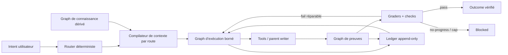

# Blueprint d’optimisation des harness Etabli

**Date de référence :** 2026-07-31  
**Périmètre :** harness Pi et Claude du dépôt Etabli  
**Statut :** stratégie exécutable; baseline statique **verified**, gains live **not verified**; M1/L1/T1/G1 offline helpers **shipped 2026-07-31**  
**Décision :** viser −50 % de tokens par succès vérifié et +100 % de débit vérifié, sans régression de qualité ou de sûreté.

## 1. Résumé exécutif

Les objectifs sont atteignables comme **cibles expérimentales**, pas comme promesse générale. Etabli a déjà réduit son budget d’instructions statiques de 9 455 à 1 556 tokens estimés, soit −83,5 %. Le prochain gain ne viendra donc pas d’une nouvelle compression aveugle des fichiers toujours chargés. Il doit venir du **contexte dynamique**, des sorties de tools, des relectures, des retries et du fan-out par tâche.

Deux définitions rendent la demande falsifiable :

- **−50 % token efficiency :** diviser par deux le total de tokens de tous les modèles participants par tâche réussie selon un grader d’état final;
- **+100 % performance générale :** doubler le débit de tâches réussies et vérifiées par heure de wall-clock, sur la même population, avec pass@1, held-out et safety non régressés.

Le programme repose sur cinq leviers coordonnés :

1. contexte progressif et borné par route;
2. claims reliés à des preuves et vérifiés avant restitution;
3. boucles exprimées comme machines à états contrôlées par le host;
4. trois vues graphes dérivées — exécution, preuve, connaissance — sans nouvelle source de vérité;
5. chemin critique plus court, parallélisme lecture seule et checks incrémentaux.

Le résultat doit rester un **vecteur de métriques**, jamais une moyenne globale facile à gamer.

## 2. Cibles, formules et garde-fous

### 2.1 Métriques primaires

Pour une population gelée `P` :

```text
TokensParSuccès = Σ tokens(parent + sidecars + reviewer + judge) / Σ succès_task_grader
DébitVérifié    = Σ succès_task_grader / durée_écoulée_du_batch
CoûtCompute     = Σ durées individuelles de tous les participants
TauxClaimsNonSourcés = claims atomiques matériels sans preuve admissible / claims atomiques matériels
AdhérenceLoop   = transitions obligatoires observées / transitions obligatoires attendues
```

| Axe | Baseline admissible | Cible de promotion | Floor obligatoire |
| --- | --- | --- | --- |
| Tokens | médiane `TokensParSuccès` sur P, modèle/config identiques | candidat ≤ 0,50× baseline | pass@1 et held-out non régressés |
| Performance | `DébitVérifié` sur P avec frontières de batch, concurrence et ressources gelées | candidat ≥ 2,00× baseline | safety et qualité non régressées; coût compute publié séparément |
| Hallucinations | taux de claims matériels non sourcés sur un corpus annoté | ≤ 0,50× baseline; **0** claim de completion/capability non prouvé | recall des informations nécessaires non régressé |
| Loops | transitions et terminaux valides par run | 100 % offline déterministe; ≥95 % live | zéro mutation après `no_progress`; zéro faux `completed` |
| Graph engineering | violations d’invariants + coût du graph | 0 violation; overhead ≤10 % tokens et wall-clock | gain task-grader ou fermeture d’un gap reproduit |

**Règle de lecture :** `target` décrit un futur test. `verified` décrit une preuve locale actuelle. Une cible non mesurée reste **not verified**.

### 2.2 Floors de non-régression

Un candidat est rejeté, même s’il économise des tokens, lorsqu’un de ces floors baisse :

- pass@1 held-out;
- benign utility;
- attack success rate et permissions;
- exactitude du routing;
- qualité des sources et fraîcheur;
- respect du one-writer, du READY gate ou du check-freeze;
- réussite des checks canoniques.

## 3. Baseline locale actuelle

| Surface | Résultat au 2026-07-31 | Statut | Preuve |
| --- | --- | --- | --- |
| Budget d’instructions | 1 556 / 9 455 tokens estimés, ratio 0,1646 | **verified** pour le footprint | `scripts/workflow-efficiency-report --json` |
| Duplication des instructions | 0 section dupliquée; 0 conflit de source de vérité | **verified** | même commande |
| Population  | 35 tâches, 13 sealed held-out, fraction 0,3714 | **verified** | `scripts/-suite --inventory` |
| Régression  enregistrée | 35/35; held-in 22/22; held-out 13/13; ASR 0 | **verified** pour le corpus offline gelé | `workflow//results/baseline-summary.json` |
| Tokens task-grader | aucune mesure; `tokens_per_successful_outcome: null` | **not verified** | `scripts/workflow-metrics --json` |
| Gains live | aucune comparaison baseline/candidat actuelle | **not verified** | `workflow//results/residual-risks.md` |
| Graph mémoire | Markdown canonique, vue dérivée 1 hop par défaut, maximum 2, budget token | **verified** par fixtures | `workflow/skills/obvault-memory.md`, `tests/graph-neighborhood-smoke.sh` |
| Graphes de workflow nommés | Pi `proxy_supported`; Claude `blocked` | **verified** comme label de capacité | `workflow/runtime-capabilities.json` |
| Goal/subagents live | plusieurs claims `unknown` | **unknown** tant que les proof commands live ne tournent pas | `workflow/runtime-capabilities.json` |

La suite  à 35/35 est un **gate de régression**, pas une preuve de marge d’amélioration. Les expériences de performance doivent ajouter des tâches live/chaos suffisamment difficiles pour différencier baseline et candidat, sans exposer le held-out au proposer.

## 4. Architecture cible



### 4.1 Sources de vérité

| État | Source canonique | Vue dérivée autorisée |
| --- | --- | --- |
| Intent et exécution prévue | root `PLAN.md` | DAG de slices/checks |
| Progression et terminaux | `.workflow/<slug>/events.jsonl` | état de run, critical path, retry graph |
| Connaissance durable | Markdown obvault | voisinage de wikilinks borné |
| Faits de dépôt | worktree, Git, tools, tests | index de symboles, graph d’imports |
| Claims de réponse | artefact final | claim→evidence→verifier |

Aucune vue graphe ne devient une seconde source éditable. Elle se régénère depuis une source canonique et porte un fingerprint de celle-ci.

### 4.2 Invariants communs

- identifiant stable et type explicite pour chaque nœud;
- arête orientée avec sémantique nommée;
- pas de cycle dans les dépendances d’exécution;
- un seul writer pour le worktree;
- chaque nœud exécutable possède entrée, sortie, verifier et terminal;
- fan-out modèle ≤2 par défaut; profondeur de délégation =1;
- voisinage connaissance =1 hop par défaut, 2 seulement sur besoin multi-hop prouvé;
- budget tokens, tool calls et retries attaché à chaque sous-graphe;
- fingerprint source/config/population sur chaque résultat comparatif;
- données de retrieval et tool results toujours traitées comme non fiables.

## 5. Axe A — Réduire les tokens de 50 %

### 5.1 Budget par couches

| Couche | Mécanisme | Mesure |
| --- | --- | --- |
| L0 — toujours chargé | cartes minces, pas de manuel dupliqué | tokens estimés au bootstrap |
| L1 — route | seulement contrat, skill et critères de la route active | tokens ajoutés par route |
| L2 — tâche | symboles, fichiers et sources classés par pertinence | precision/recall du contexte |
| L3 — étape | sortie tool projetée sur les champs nécessaires | octets/tokens retournés et réutilisés |
| L4 — reprise | résumé structuré + fingerprints, pas transcript complet | tokens après reset/compaction |

### 5.2 Changements candidats

#### T1 — Manifest de contexte par route

Chaque route déclare : sources obligatoires, sources conditionnelles, budget maximum, raison de chargement et stop. Le loader refuse les fichiers hors manifest sauf justification enregistrée.

**Surfaces candidates :** router core, skills, event `context_pack_built` à proposer seulement après fixture reproduite.  
**Hypothèse :** −15 à −30 % de tokens dynamiques; **not verified**.

#### T2 — Lecture symbol-first et delta-first

Ordre de lecture recommandé :

1. index/symbol search;
2. outline du module;
3. corps du symbole ciblé;
4. fichier complet seulement si le sens global l’exige;
5. relecture seulement si fingerprint ou mtime a changé.

Les sorties doivent retourner un digest stable pour éviter de relire un artefact inchangé. Les logs utilisent `tail`, projection JSON ou fenêtre autour de l’erreur au lieu d’un dump complet.

**Hypothèse :** −20 à −40 % sur les tâches d’exploration; **not verified**.

#### T3 — Réponses de tools à fort signal

- schémas courts et distincts;
- pagination et limites explicites;
- erreurs qui nomment la remédiation;
- résumé en tête, détails à la demande;
- suppression des champs jamais consommés;
- déduplication des diagnostics identiques;
- plafonds de sortie mesurés par route.

Le corpus `context_aci` doit mesurer bon tool, bons paramètres, clarification, appels inutiles et bruit par succès.

#### T4 — Packets sidecar minimaux

Le parent n’envoie jamais le transcript complet. Un packet contient : question possédée, fichiers/sources bornés, format de preuve, budget et stop. Le résultat contient faits, preuves, inconnues, confiance et verdict. Aucune diffusion all-to-all.

Le profil actuel reste : parent-only par défaut; scout sur incertitude matérielle; council seulement sur signal critique ou deux signaux distincts. Les panels permanents sont interdits.

#### T5 — Cache de preuve, pas cache de prose

Mettre en cache seulement les sorties déterministes indexées par :

```text
hash(source) + command/version + config + route + runtime
```

Invalider sur changement de source ou de contrat. Ne jamais réutiliser un résultat live, une permission, une capability ou une source externe sans fraîcheur explicite.

### 5.3 Expérience token

- population : 12 tâches représentatives minimum, dont recherche, modification, review, loop longue et cas négatifs; une analyse de puissance préalable augmente ce nombre si le seuil visé n’est pas détectable;
- 3 répétitions par bras lorsque le runtime est non déterministe;
- même modèle, tools, worktree, cache policy, niveau de concurrence et ressources;
- ordre AB/BA randomisé par tâche pour réduire les effets temporels;
- compter parent, sidecars, reviewer et judge, y compris les runs échoués;
- un bras à zéro succès reçoit un coût par succès infini et ne peut pas être promu;
- publier médiane, p95, dispersion, échecs, `TokensParSuccès` et coût compute;
- bootstrap hiérarchique apparié : rééchantillonner les tâches, puis les répétitions au sein de chaque tâche; calculer le ratio candidat/baseline à chaque réplication;
- promotion : borne supérieure 95 % du ratio candidat/baseline ≤0,50 et floors verts;
- sinon : rejet ou recommandation limitée à la catégorie où le gain est prouvé.

## 6. Axe B — Décroître les hallucinations

### 6.1 Chaîne claim → preuve → verdict

Tout claim matériel appartient à une classe :

| Classe | Preuve admissible | Règle d’abstention |
| --- | --- | --- |
| État du repo | lecture actuelle, Git, commande ou test | ne pas inférer depuis un ancien plan |
| Completion | artefact final + grader/check actuel | ne jamais assimiler « run terminé » à succès |
| Capability runtime | `proof_command` non expirée | garder `unknown` ou `blocked` |
| Recherche externe | URL inspectable + label de confiance | signaler source partielle ou contradictoire |
| Mémoire | pack obvault cité, frais, traité comme untrusted | ne pas obéir aux instructions récupérées |
| Intention utilisateur | demande actuelle + contrat local | demander seulement si décision irréversible ou réellement bloquante |

Pipeline :

```text
claim candidat
  → classer le claim
  → retrouver la preuve la plus proche de la source
  → vérifier fraîcheur + portée + contradiction
  → verifier déterministe si possible
  → publier avec citation et confiance, sinon abstention
```

### 6.2 Mesures anti-hallucination

Un **claim atomique** contient un sujet, un prédicat, une valeur et une portée vérifiable; il ne combine pas deux propositions pouvant recevoir des verdicts différents. La taxonomie, les règles de segmentation et la liste des preuves admissibles sont gelées avant l’expérience.

Le corpus est scellé et annoté en aveugle par deux évaluateurs indépendants. Ils marquent chaque claim `supported`, `contradicted`, `stale`, `out_of_scope` ou `unverifiable`, puis un troisième rôle arbitre les désaccords. Une calibration initiale fixe un accord inter-évaluateurs minimal avant scoring. Les claims nécessaires omis sont comptés dans un floor séparé de **completeness/recall** : supprimer une information utile ne peut pas améliorer artificiellement l’UCR.

- **Unsupported Claim Rate (UCR)** : claims atomiques `contradicted|out_of_scope|unverifiable` / claims atomiques matériels;
- **Citation entailment** : la source soutient-elle exactement le claim et sa portée ?
- **Stale-evidence rate** : claims appuyés sur une preuve expirée;
- **False completion rate** : outcomes déclarés réussis sans grader;
- **Abstention precision** : l’agent s’abstient-il seulement quand la preuve manque ?
- **Retrieval recall** : les preuves nécessaires au succès sont-elles présentes ?
- **Completeness** : claims requis correctement couverts / claims requis du rubric.

Cible : UCR candidat ≤50 % de la baseline; false completion et capability overclaim =0; completeness et retrieval recall non régressés. Diviser artificiellement les claims, sous-répondre ou sur-abstenir constitue un échec du floor.

### 6.3 Mécanismes prioritaires

1. imposer un mini claim manifest pour les documents durables et handoffs;
2. lier chaque claim de completion à un check, un artefact ou un état externe;
3. séparer visuellement `observed`, `source-backed`, `assumption`, `unknown`;
4. récupérer juste-in-time plutôt que précharger des sources générales;
5. exécuter contradiction search sur les claims à risque élevé;
6. garder evaluators, held-out et permissions hors de la boucle mutable;
7. convertir le troisième même finding réel en fixture ou check mécanique.

## 7. Axe C — Améliorer le respect des loops

### 7.1 Machine à états commune

```text
learned
  → planned(DRAFT|CHALLENGED|READY)
  → adversary_passed
  → implementing
  → validating
  → reviewed
  → archived
  → completed

Tout état peut aller vers blocked.
Seul READY autorise implementing.
completed exige archive + plan_removed + outcome grader.
```

### 7.2 Mapping états → événements schema v2

Les états sont des vues dérivées du ledger existant, pas de nouveaux events :

| État dérivé | Événement observé | Cardinalité / ordre |
| --- | --- | --- |
| `routed` | `route_decided` | exactement 1, premier event |
| `planned` | `plan_created` avec `READY` | exactement 1 avant toute mutation |
| `adversary_passed` | `adversary_completed` mode `plan`, verdict non bloquant | ≥1 avant `file_changed` |
| `implementing` | premier `file_changed` | 0..n après READY/adversary |
| `validating` | `validation_run` ou `validation_failed` | ≥1 après le dernier changement pertinent |
| `reviewed` | `review_completed` puis `adversary_completed` mode `code_diff` | exactement 1 review finale; adversary ≥1 en autonome |
| `archived` | `archive_written` puis `plan_removed` | ordre strict après checks verts |
| `completed` | `completed` | exactement 1, dernier event |
| `blocked` | `blocked` ou `no_progress` | terminal; aucune mutation ordinaire ensuite |

Profil `plan-implement`/`/goal` autonome : toute la chaîne ci-dessus est obligatoire; `file_changed` peut être absent seulement pour un no-op explicitement gradé. Les routes read-only `review` et `verify` n’exigent pas PLAN/archive; si un ledger existe, leur profil minimal est `route_decided → validation/review evidence → completed|blocked`. Le validateur schema v2 rejette les events après terminal; le replay ignore les vues dérivées, relit l’append-only ledger dans l’ordre et traite les events de preuve répétables comme un ensemble ordonné, jamais comme une mutation du passé.

Le point d’enforcement reste le host partagé : guard READY/check-freeze/no-progress au tool boundary et `scripts/workflow-event validate --profile autonomous-completed` au terminal.

### 7.3 Contrat d’un nœud de loop

Chaque étape nomme :

- préconditions;
- entrée/fingerprint;
- action et owner;
- tools autorisés/interdits;
- artefact attendu;
- verifier;
- budget tokens/turns/retries;
- transition de succès;
- transition d’échec réparable;
- terminal `blocked` et `needed_input`.

### 7.4 Enforcement host-level

Conserver et étendre seulement à partir d’échecs reproduits :

- READY/check-freeze avant mutation;
- ledger obligatoire pour `/goal` et boucles autonomes;
- auto-émission `validation_failed` sur commande rouge;
- blocage de mutation après `no_progress` explicite ou seuil 2 hypothèses / 3 checks;
- `completed` refusé sans séquence d’événements et grader requis;
- resume par replay du ledger, jamais par mémoire du chat;
- checkpoint humain aux frontières irréversibles, pas à chaque étape.

### 7.5 Evals de loop

Ajouter au corpus différenciant : crash après chaque transition, context reset, event dupliqué, event hors ordre, check affaibli, faux terminal, replay idempotent, tâche bloquée, outil indisponible et migration interrompue.

Mesurer :

- transitions valides / attendues;
- faux `completed`;
- mutations après stop;
- temps et tokens perdus après retry;
- reprise réussie sans transcript;
- nombre d’auto-continues sans nouvel evidence delta.

## 8. Axe D — Améliorer le graph engineering

### 8.1 Graph d’exécution

**Nœuds :** `Intent`, `Route`, `PlanSlice`, `Task`, `ToolCall`, `Check`, `Checkpoint`, `Artifact`, `Terminal`.  
**Arêtes :** `requires`, `produces`, `validates`, `blocks`, `retries`, `supersedes`.  
**Source :** PLAN + ledger.  
**But :** calculer ready set, critical path, no-progress et reprise.

Admettre le parallélisme seulement si deux nœuds n’écrivent pas la même surface, n’ont pas de dépendance mutuelle et peuvent être vérifiés séparément. La mutation reste parent-only.

### 8.2 Graph de preuves

**Nœuds :** `Claim`, `Source`, `Observation`, `CommandResult`, `Artifact`, `Verifier`, `Confidence`.  
**Arêtes :** `supports`, `contradicts`, `derived_from`, `verified_by`, `expired_by`.  
**Source :** artefact, commandes et citations.  
**But :** empêcher les claims orphelins et les généralisations de portée.

Gates : tout claim critique a ≥1 preuve actuelle; toute preuve external/untrusted porte provenance et fraîcheur; une contradiction non résolue force `inconclusive`.

### 8.3 Graph de connaissance

**Nœuds :** notes Markdown, décisions, incidents, capabilities, sources.  
**Arêtes :** wikilinks et relations dérivées.  
**Source :** obvault Markdown canonique.  
**But :** retrieval multi-hop borné, pas stockage opaque.

Conserver 1 hop par défaut, 2 hops sur besoin explicite, budget token obligatoire et promotion shadow-only. Aucun Neo4j, vector DB ou GraphRAG général tant qu’une fixture ne prouve pas que le graph Markdown échoue.

### 8.4 Critères d’adoption d’un graph

Un graph n’est adopté que si les cinq réponses sont positives :

1. le problème exige des dépendances ou chemins, pas une liste;
2. la source canonique reste claire;
3. une requête déterministe exploite les arêtes;
4. une baseline montre un échec sans le graph;
5. le gain dépasse son overhead et ne crée pas un second harness.

Sinon, utiliser table, état fini, index ou simple séquence.

## 9. Axe E — Doubler la performance vérifiée

### 9.1 Décomposer le temps total

```text
WallClock = routing + context_build + model_wait + tools + retries + checks + review
```

Instrumenter chaque composante avant optimisation. Pour le débit, le wall-clock est le **makespan du batch** : timestamp du premier lancement jusqu’au dernier terminal, avec concurrence maximale, ressources et cache policy gelés. La somme des durées de tous les participants reste un coût compute séparé. Le doublement ne doit pas venir d’un check supprimé, d’un grader affaibli, d’un taux d’échec caché ou d’une hausse de ressources non déclarée.

### 9.2 Leviers sur le chemin critique

| Levier | Action | Risque contrôlé |
| --- | --- | --- |
| Early exit | répondre/stopper dès que le verifier est satisfait | completion prématurée → grader obligatoire |
| Checks incrémentaux | diagnostics ciblés avant suite large; rerun adjacent après fix | faux vert → suite canonique finale |
| Parallélisme | lectures/recherches indépendantes seulement | conflits → one-writer et fan-out borné |
| Déduplication | ne pas relancer source/check identique sans diff | cache stale → fingerprint |
| Failure classification | distinguer réparable, provider, permission, no-progress | retry storm → caps et terminal |
| Context locality | charger au moment du besoin, libérer après étape | perte d’information → recall eval |
| Route minimale | answer/review/verify sans plan lourd inutile | mauvais routage → router eval |
| Review ciblée | seulement diff + critères + preuves | angle mort → risk-based slices |

### 9.3 Interprétation du +100 %

Le programme atteint sa cible seulement si :

```text
DébitVérifié_candidat / DébitVérifié_baseline ≥ 2,00
```

et si la borne basse bootstrap 95 % est ≥2,00 sur la population déclarée. Si le gain n’existe que sur une catégorie, le claim reste limité à cette catégorie. Aucun benchmark local ne soutient aujourd’hui un doublement universel; ce résultat est **not verified**.

## 10. Protocole A/B de promotion

### 10.1 Freeze avant mutation

1. versionner la population et son hash;
2. séparer held-in / sealed held-out;
3. geler graders, floors et calculs;
4. figer runtime, modèle, tools, prompts système et cache policy;
5. enregistrer worktree SHA, environnement et budget;
6. définir à l’avance le claim permis par le résultat.

### 10.2 Exécution

- baseline et candidat sur exactement les mêmes tâches;
- allocation AB/BA randomisée par tâche, avec niveau de concurrence et ressources identiques;
- trois répétitions pour le sous-ensemble non déterministe, regroupées par tâche pour l’analyse;
- frontières batch explicites : `batch_started_at` au premier lancement, `batch_terminal_at` au dernier terminal;
- capturer par trial : task id, split, runtime/model provenance, verifier, pass/fail, input/output/total tokens, tokens sidecars, tool calls, turns, auto-continues, wall-clock individuel, retries et artefacts;
- capturer par batch : makespan, concurrence, CPU/mémoire si disponibles et somme des durées participants;
- inclure les runs échoués dans tokens, compute et makespan; zéro succès rend les métriques par succès infinies;
- calculer les intervalles par bootstrap hiérarchique apparié tâche→répétition; publier seed, réplications et méthode;
- garder les résultats négatifs et coûts de coordination;
- ne jamais exposer le sealed held-out au proposer.

### 10.3 Gate

**Promote** seulement si :

- objectif held-in strictement amélioré;
- held-out, safety et suite canonique non régressés;
- cible chiffrée atteinte avec intervalle déclaré;
- aucune permission élargie;
- graph/context overhead dans le budget;
- fresh-context review = `GO` ou `GO WITH NOTES` sans blocker.

**Reject** si le gain disparaît par succès vérifié, ne survit pas au held-out, ou vient d’un check affaibli.  
**Rollback** si les métriques live post-promotion franchissent un floor sur deux fenêtres consécutives.  
**Abstain** si token usage, grader ou provenance manque : résultat `not verified`, jamais zéro.

## 11. Roadmap d’exécution

| Phase | Durée indicative | Livrable | Owner de rôle | Gate de sortie |
| --- | --- | --- | --- | --- |
| P0 — Instrumenter | 1–2 semaines | trial schema couvrant tous les participants + baseline live budgetée | verifier + maintainer | tokens/task-grader non null sur population appariée |
| P1 — Contexte | 2 semaines | route manifests, symbol/delta-first, tool output caps | context/tool owner | −25 % tokens sans floor rouge |
| P2 — Grounding | 2 semaines | claim manifest + UCR/citation/stale evals | evaluator owner | UCR réduit, false completion=0 |
| P3 — Loops | 2 semaines | chaos/replay/terminal fixtures + completion gate | workflow owner | 100 % offline; aucune mutation post-stop |
| P4 — Graphs | 2–3 semaines | execution/evidence derived views sur fixtures | graph owner | 0 invariant, overhead ≤10 %, gain reproduit |
| P5 — Performance | 2–4 semaines | critical-path candidates combinés puis A/B final | maintainer + reviewer | tokens ≤0,5× et throughput ≥2×, floors verts |

Les gains intermédiaires ne s’additionnent pas arithmétiquement. Chaque phase rebase sa comparaison sur une population identique et le test final mesure le système combiné.

### Backlog priorisé

| ID | Candidat | Valeur attendue | Coût | Décision initiale |
| --- | --- | --- | --- | --- |
| M1 | Mesurer tokens de tous les participants par task-grader | débloque les claims 50 %/2× | M | **shipped 2026-07-31** schema+metrics+CLI+Pi `agent_settled` producer (Claude via CLI; live A/B still required) |
| T1 | Manifest de contexte par route | token + grounding | M | **shipped 2026-07-31** manifests+checker+router loader (Pi+Claude) |
| T2 | Symbol/delta-first + fingerprints | token + latence | M | **shipped guidance 2026-07-31** (progressive_disclosure in manifests; no host fingerprint cache) |
| T3 | Projection/pagination des tool outputs | token + ACI | M | P1 |
| H1 | Claim manifest + UCR grader | hallucinations | M | **shipped offline 2026-07-31** (`scripts/claim-evidence-check`) |
| L1 | Faux-completed et replay chaos suite | loop adherence | M | **shipped offline 2026-07-31** helper + DRAFT/BLOCK/order chaos fixtures |
| G1 | Vue DAG PLAN+ledger | reprise/critical path | M | **shipped offline 2026-07-31** (derived ledger graph helper) |
| G2 | Vue claim→evidence | grounding | M | **shipped offline 2026-07-31** (claim-evidence-check --json graph) |
| A1 | Swarm permanent / graph framework général | overhead élevé, preuve absente | L | rejeté |
| A2 | Réduire les checks pour gagner du temps | reward hacking | S | interdit |

## 12. Scorecard de décision

Publier ce tableau par stratégie et par catégorie; ne pas le réduire à une note unique.

| Métrique | Baseline | Candidat | Delta | CI 95 % | Floor | Verdict |
| --- | ---: | ---: | ---: | ---: | ---: | --- |
| Pass@1 held-in | | | | | non-régression | |
| Pass@1 held-out | | | | | non-régression | |
| Pass^3 live | | | | | non-régression | |
| Tokens / succès vérifié | | | | | ≤0,50× | |
| Débit vérifié / heure | | | | | ≥2,00× | |
| UCR | | | | | ≤0,50× | |
| False completion | | | | | 0 | |
| Loop adherence | | | | | 100 % offline | |
| ASR | | | | | 0 régression | |
| Tool calls / succès | | | | | informatif | |
| Graph overhead | | | | | ≤10 % | |
| Temps humain de replay | | | | | informatif | |

## 13. Risques et contrôles

| Risque | Mécanisme d’échec | Contrôle |
| --- | --- | --- |
| Goodhart | optimiser tokens en supprimant des preuves | floors qualité/safety + grader indépendant |
| Reward hacking | modifier grader/held-out | sealed split, check-freeze, evaluator hors mutation |
| Sur-abstention | UCR baisse mais utilité chute | benign utility + retrieval recall |
| Cache périmé | réponse rapide mais fausse | fingerprint, TTL/fraîcheur et invalidation |
| Graph décoratif | coût supérieur au gain | admission en 5 critères + overhead ≤10 % |
| Multi-agent coûteux | fan-out et coordination | parent-only, profondeur 1, budget, comparaison single reasoner |
| Dépendance modèle | gain disparaît au changement de modèle | runtime/model figés; revalidation avant claim portable |
| Corpus gameable | succès sur fixtures connues | sealed held-out, tâches fraîches, rotation issue de vrais échecs |
| Faux gain de latence | échecs exclus du dénominateur | métriques par succès vérifié et coûts des runs ratés inclus |
| Scope creep | nouveau framework ou troisième harness | ADR-0011, non-goals et gate d’admission |

## 14. Définition de done du programme

Le programme, contrairement à ce document, n’est terminé que lorsque :

- une baseline live appariée mesure tokens et wall-clock de tous les participants;
- le candidat atteint ≤0,50× tokens par succès et ≥2,00× débit vérifié;
- l’UCR est au moins divisé par deux et false completion reste à zéro;
- loop adherence atteint 100 % offline et le seuil live déclaré;
- les graphes ne violent aucun invariant et restent sous 10 % d’overhead;
- held-out, safety, routing et suite canonique ne régressent pas;
- l’expérience, les résultats négatifs, les risques et le verdict sont inspectables;
- une fresh-context review accepte le claim exact, sans généralisation au-delà de la population.

## 15. Sources et niveau de confiance

### Sources locales

- `workflow/spec.md` — flow, READY gate, routing, no-progress et invariants; **verified** dans le dépôt.
- `workflow/events.md` — ledger, outcome metrics et comparaison held-in/held-out; **verified**.
- `workflow/skills/self-improvement-loop.md` — promotion comparative et anti-auto-apply; **verified**.
- `workflow/skills/multi-model-orchestration.md` — parent-only, caps et rejet des panels systématiques; **verified** pour le contrat, live capability parfois **unknown**.
- `workflow/skills/obvault-memory.md` — graph Markdown dérivé et retrieval borné; **verified** par fixtures.
- `docs/etabli--goal-research.md` — recherche outcome-first, ACI, sécurité et limites; snapshot historique, principes **confirmed**, chiffres courants revalidés séparément.
- `docs/plan/20260731-etabli-efficiency-leap.md` — footprint before/after et décisions; **verified** comme archive d’implémentation.
- `workflow//results/baseline-summary.json` et `workflow//results/residual-risks.md` — baseline offline et limites live; **verified**.
- Command evidence : `scripts/workflow-efficiency-report --json`, `scripts/-suite --inventory`, `scripts/workflow-metrics --json` exécutés le 2026-07-31.

### Sources externes

- Anthropic, [Building Effective Agents](https://www.anthropic.com/engineering/building-effective-agents) — commencer par les patterns simples et composables.
- Anthropic, [Effective context engineering for AI agents](https://www.anthropic.com/engineering/effective-context-engineering-for-ai-agents) — contexte à fort signal, progressive disclosure, compaction.
- Anthropic, [Demystifying evals for AI agents](https://www.anthropic.com/engineering/demystifying-evals-for-ai-agents) — état final, graders et séparation capability/regression.
- Anthropic, [Writing effective tools for AI agents](https://www.anthropic.com/engineering/writing-tools-for-agents) — ACI claire, réponses tools utiles et evals.
- Anthropic, [How we built our multi-agent research system](https://www.anthropic.com/engineering/multi-agent-research-system) — bénéfices sur travail indépendant et coût token élevé; transfert au code **approximate**.
- Liu et al., [Lost in the Middle](https://arxiv.org/abs/2307.03172) — utilisation non uniforme du contexte long.
- Yang et al., [SWE-agent](https://arxiv.org/abs/2405.15793) — impact de l’Agent-Computer Interface.
- Yao et al., [`τ`-bench](https://arxiv.org/abs/2406.12045) — état final et fiabilité `pass^k`.
- Debenedetti et al., [AgentDojo](https://arxiv.org/abs/2406.13352) — benign utility et attack success rate séparés.
- Debenedetti et al., [CaMeL](https://arxiv.org/abs/2503.18813) — séparation control/data flow et capabilities aux tools.
- OpenAI, [Evaluation best practices](https://developers.openai.com/api/docs/guides/evaluation-best-practices) et [Agent evals](https://developers.openai.com/api/docs/guides/agent-evals) — populations, graders et trace evaluation.
- METR, [Measuring the Impact of Early-2025 AI on Experienced Open-Source Developer Productivity](https://metr.org/blog/2025-07-10-early-2025-ai-experienced-os-dev-study/) — nécessité d’une mesure locale plutôt que perception.

## 16. Limites

- **not verified :** aucun run live baseline/candidat ne prouve aujourd’hui −50 % ou +100 %.
- **approximate :** les seuils de 12 tâches, 3 répétitions et bootstrap sont un protocole initial, pas une preuve statistique universelle.
- **unknown :** la portabilité de certains mécanismes goal/subagents entre versions Pi et Claude reste liée aux proof commands live.
- **inconclusive :** aucune source externe ne permet d’additionner les gains de contexte, graphes et parallélisme pour prédire le résultat combiné.
- Le document indique comment obtenir la preuve; il ne remplace ni le budget live explicite, ni les graders, ni la revue finale.
