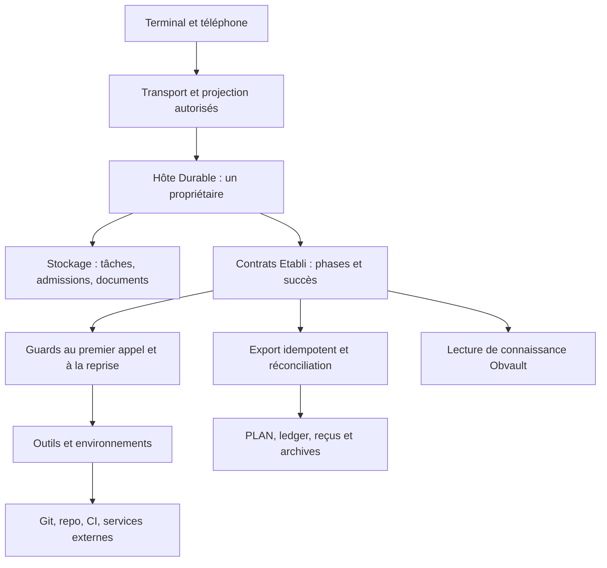

# Etabli : quelles fonctions pourraient profiter de Pi Durable ?

Date de l'étude : 2026-10-01 UTC. Demande : examiner les fonctions d'Etabli en profondeur, identifier leur bénéfice réel et leur coût d'intégration avec Pi Durable.

**Verdict : Pi Durable est surtout intéressant pour la coordination et la reprise des travaux longs.** Les meilleurs candidats sont les chaînes de revue, les missions `/goal` et `plan-implement`, les tâches et sous-agents, Pi Mobile, les attentes CI et les campagnes d'évaluation. Il peut leur fournir un état d'exécution commun, enregistré avant d'être affiché, au lieu de plusieurs mécanismes de récupération indépendants.

Etabli possède déjà des journaux, des plans, des reprises et des garde-fous ; certaines extensions installées possèdent aussi leur propre persistance. Le gain attendu est leur cohérence et la réduction des reprises manuelles. Aucun gain chiffré de qualité, coût, vitesse ou fiabilité n'est démontré pour Etabli à ce stade.

**Recommandation : commencer par une chaîne de revue en lecture seule dans un hôte Durable séparé, puis étendre vers l'observation mobile et les missions plus longues.** Une migration générale du CLI serait prématurée : le moteur est expérimental et le démonstrateur Durable ne charge pas les extensions classiques.

## 1. Périmètre, versions et niveau de preuve

| Surface | Référence examinée | Niveau de preuve |
|---|---|---|
| Etabli versionné | `fd4bf728f297eae867e5115ab10e3269fb037992`, worktree `/Users/tonours/.codex/worktrees/0598/etabli` | `verified` : inventaire et lecture statique des contrats, implémentations centrales, adaptateurs et tests pertinents |
| Pi upstream | `7fbbd5f4a1d982bb02d63472dde0774fa639f99b`, clone voisin `../pi-upstream` ; package Durable `1.0.0` | `verified` : source et tests lus ; ils n'ont pas tous été réexécutés |
| Pi CLI local | `1.0.0`, mis à jour dans la demande précédente | `verified` pour version/help ; intégration Etabli avec Durable `not verified` |
| Extensions npm locales | Métadonnées et portions pertinentes sous `/Users/tonours/.pi/agent/npm/node_modules` | `verified` pour versions et comportements lus ; activation et interopérabilité en session réelle `not verified` |
| Satellite Pi Mobile | `/Volumes/Crucial/work/pi-mobile`, commit `694c187ca061eaca481b9c3bfd3f0ed1eb871dd8` | `verified` statiquement ; connexion téléphone réelle `not verified` |
| Activité récente | Agrégat local des ledgers, du 2026-09-01 au 2026-10-01T21:42:31Z | `verified` pour les nombres produits ; causalité et retour sur investissement `inconclusive` |
| Bénéfices et trajectoire proposés | Analyse de correspondance entre ces sources | `proxy-supported` : hypothèses techniques étayées, à mesurer dans un pilote |

L'inventaire comprend **982 fichiers suivis, 9 entrées d'extension Pi, 52 scripts d'entrée, 81 lignes au catalogue de skills, 18 skills locaux Pi suivis, 28 skills sur l'étagère `extras/`, et 12 déclarations de packages Pi**. Ces nombres décrivent des surfaces différentes et ne s'additionnent pas. Les 18 entrées `pi_core=1` du catalogue comprennent aussi des skills vendus ; elles ne désignent pas exactement les 18 dossiers locaux Pi.

La couverture porte sur toutes ces surfaces fonctionnelles, avec une lecture approfondie des mécanismes qui changent la décision d'intégration. Ce n'est ni une lecture exhaustive de chaque ligne des dépendances tierces, ni un audit de production. Les annexes nomment chaque entrée pour rendre la couverture contrôlable.

Les contrats partagés, les sources courantes et leurs propriétaires priment sur les anciens comptes rendus. Les extensions présentes ne prouvent pas qu'une chaîne complète est active. En particulier, `workflow/runtime-capabilities.json` contient des observations datées ; `pi/agent/subagents.json` comporte une configuration restrictive et un commentaire ancien sur l'absence de package, alors que le package figure désormais dans les settings. Aucun test de runner n'a été lancé pour trancher l'état opérationnel.

Obvault a été consulté par son entrée `_meta/obvault context`, avec retour lexical faute de provider configuré. Les résultats apportaient peu de preuve spécifique à Durable ; les conclusions reposent sur les sources courantes. Aucun état d'exécution, transcript ou nouvelle note de mémoire n'a été écrit dans le vault.

Sources de périmètre : [README](../../README.md), [contrat](../../workflow/spec.md), [propriétaires](../../workflow/runtime/source-ownership.tsv), [catalogue](../../workflow/runtime/skill-surface.tsv), [settings](../../pi/agent/settings.json), [surfaces de liens](../symlink-layout.md), [ADR-0006](../adr/0006-keep-agent-surfaces-as-adapters-over-shared-workflow-contracts.md).

## 2. Ce que Durable apporte réellement

L'[article de présentation](https://earendil.com/posts/pi-durable/) décrit un moteur où les conversations, les tâches et les documents d'état peuvent vivre dans le même stockage transactionnel. L'analyse du code précise les limites de cette promesse.

| Mécanisme | Comportement observé dans upstream | Utilité pour Etabli |
|---|---|---|
| Transaction interne | Entrées, documents, tâches et admissions de messages sont préparés ensemble ; le stockage précède l'adoption et la publication du nouvel état | Éviter un écran « terminé » alors que le résultat ou le compteur n'est pas enregistré. [session.ts][u-session] |
| Tâche à checkpoints | Une phase reprend depuis son checkpoint. À la réouverture, les tâches qui étaient `running` redeviennent `pending` ; l'hôte doit réinstaller le registry et relancer l'exécution | Conserver la phase, les enfants et les attentes d'une mission, sans reconstruire tout son avancement depuis le prompt. [scheduler.ts][u-scheduler] |
| Ownership | Les tâches/conversations ont un propriétaire ; annulation descendante, drainage des enfants, frontières de fond et politiques d'attente | Définir qui doit attendre qui, qui peut survivre à un arrêt interactif, et quand la mission peut réellement finir. [contrat d'ownership][u-ownership] |
| Messages identifiés | Un `requestId` retrouve l'admission déjà enregistrée dans la même conversation | Résister aux renvois d'un téléphone ou d'un reporter. Il faut conserver l'identifiant lors du retry et ne pas le recycler pour un nouveau contenu. [submissions.ts][u-submissions] |
| Vue observable | Snapshot et abonnement pris sur une même ligne de mutation ; vue sur les entrées et `pi.agent`, `pi.live`, `pi.inbox`, `pi.usage` | Montrer un état cohérent à plusieurs interfaces. Les documents Etabli personnalisés nécessitent une projection propre. [view.ts][u-view], [events.ts][u-events] |
| Outil à politique de replay | Un outil interrompu est rejoué seulement si les politiques enregistrée et actuelle sont toutes deux `safe` ; sinon résultat `interrupted` | Décider explicitement quelles opérations peuvent être répétées et lesquelles doivent être réconciliées. [tool.ts][u-tool] |
| Compaction suivie | Compaction en fond ou bloquante, tâche persistante, résumés pouvant devenir `stale`, ancien historique conservé | Porter session-hygiene sur un cycle de vie observable et reprenable. [compaction.ts][u-compaction] |
| Registry rechargeable | Le stockage conserve les noms et checkpoints, pas le code ; appels déjà engagés avec l'ancienne implémentation, étapes suivantes avec la nouvelle | Mettre à jour des outils sans effacer l'état ; exige des versions, migrations et fingerprints maîtrisés. [scheduler.ts][u-scheduler], [exemple 31][u-example31] |

Pour « profiter pleinement », une fonction doit utiliser ce cycle de vie pour ses phases, ses messages et son résultat. Faire lancer le CLI actuel par une tâche Durable ne rend pas automatiquement durables les opérations internes de ses extensions.

L'état transactionnel reste local au stockage de Durable. Il n'englobe pas simultanément le système de fichiers du repo, Git, GitHub, Linear, le navigateur et `.workflow/events.jsonl`. Cette frontière est décisive pour Etabli.

## 3. État actuel : le besoin existe, son coût reste à mesurer

Commande de lecture utilisée depuis le worktree :

```bash
scripts/workflow-ship-metrics --dir /Volumes/Crucial/work/etabli/.workflow report --since 2026-09-01 --json
```

Résultat brut local : `/tmp/etabli-pi-durable-patterns-20261001.json`. Projection sélectionnée pour cette étude :

```json
{
  "window": {"since": "2026-09-01", "until": "2026-10-01T21:42:31Z"},
  "completed_ledgers": 35,
  "accepted_results": null,
  "review_budget_exhausted": {
    "observations": 6, "initiatives": 6, "families": 4,
    "recorded_resolved_runs": 3, "unmapped_runs": 3
  },
  "review_requested": {
    "observations": 4, "initiatives": 4, "families": 1,
    "recorded_resolved_runs": 4, "unmapped_runs": 0
  },
  "sources": {
    "ledgers": "available", "guard_journal": "available", "archives": "partial",
    "cost_usage": "missing", "accepted_merge_receipts": "missing",
    "review_minutes_receipts": "missing", "herdr_history": "not-provided"
  },
  "archive_diagnostics": 3
}
```

Les **35 ledgers terminés ne prouvent pas 35 résultats acceptés**. Les quatre attentes de revue appartiennent à une seule famille ; les compter comme quatre incidents indépendants serait trompeur. Les résolutions sont des liens enregistrés vers des successeurs terminés, pas une vérification indépendante de leur livraison.

Ces observations justifient d'examiner la coordination et la conservation des budgets. Elles ne montrent pas combien de reprises provenaient d'un crash, combien de tokens ont été répétés, ni combien de temps Durable aurait économisé. Les budgets épuisés, findings non corrigés, permissions absentes et erreurs de provider restent des problèmes que la persistance seule ne résout pas.

Sources : [calcul des motifs](../../scripts/lib/workflow-patterns.mjs), [lineage](../../scripts/lib/workflow-lineage.mjs), [rapport](../../scripts/lib/ship-metrics-report.mjs).

## 4. Carte des fonctions et décisions

Le bénéfice est relatif à l'existant observé. Le coût désigne l'effort d'adaptation et de validation ; ce n'est pas une estimation en jours. Chaque bénéfice proposé reste `proxy-supported`.

| ID | Fonction | Bénéfice attendu | Coût relatif | Décision |
|---|---|---|---|---|
| F01 | `/goal`, missions longues, continuation | Élevé : même mission, mêmes budgets et phase après reprise | Fort | Cible majeure après un pilote borné |
| F02 | `plan-loop` et adversary | Moyen à élevé sur plans/revues longs | Moyen | Conserver `PLAN.md` comme contrat canonique |
| F03 | `plan-implement`, `implement`, `ship` | Élevé : reprise des étapes et enfants | Très fort pour ship | Porter par tranches ; réconcilier les effets externes |
| F04 | Tasks et subagents | Élevé pour une coordination commune ; persistance déjà partielle/avancée | Très fort | Consolider après preuve d'interopérabilité actuelle |
| F05 | Review hunters et revues fraîches | Élevé : résultats, attentes et budgets cohérents | Moyen à fort | **Premier pilote recommandé** |
| F06 | CI fix et attentes PR/CI | Élevé : deadlines, attente, reprise sur le bon HEAD | Moyen à fort | Deuxième tranche ; écritures séparément contrôlées |
| F07 | Linear et création de tickets | Moyen sur chaînes longues ; faible sur création simple | Moyen | Outils d'écriture non rejoués sans réconciliation |
| F08 | Bug-check, verify, QA, sec-pr | Moyen sur dossiers longs et étapes externes | Moyen | Reprise des preuves ; qualité des conclusions inchangée |
| F09 | Pi Mobile | Très élevé pour admission et observation cohérentes | Moyen à fort | Meilleur fit d'interface, après hôte/projection sûrs |
| F10 | Autoresearch et long-loop | Élevé pour campagnes interrompues | Fort | Identité d'expérience et résultat extérieur à réconcilier |
| F11 | Benchmarks, skill-eval, trigger-runner | Élevé à grande population ; faible pour un appel isolé | Moyen à fort | Reprise par cellule avec évaluateur gelé |
| F12 | Recurring-run et routines | Élevé pour exécutions longues répétées | Moyen | Étagère optionnelle ; scheduler externe conservé |
| F13 | Maintainer-orchestrator et maintenance PR | Élevé pour files d'attente et portfolio | Fort | Opportunité future, pas un service actif démontré |
| F14 | Compaction et session-hygiene | Moyen : tâche observable/reprenable | Moyen | Un seul contrôleur de compaction |
| F15 | Ledger, handoff, corrections, archives | Moyen à élevé pour cohérence d'état | Fort pour réconciliation | Projection réconciliable ; format d'évidence conservé |
| F16 | Budgets, coûts, observabilité | Moyen à élevé si reliés à toute la descendance | Moyen à fort | Mesurer tentatives et coûts inconnus séparément |
| F17 | Router, READY, consentement, guards | Faible gain isolé ; intégration indispensable | Fort côté sûreté | Réutiliser le code canonique, recontrôler au replay |
| F18 | Worktrees, leases, Herdr | Moyen pour état d'orchestration | Fort en multihost | Exclusivité et récupération Git restent externes |
| F19 | MCP et providers externes | Moyen sur chaînes d'outils longs | Fort | Port sélectif, identité et politique par méthode |
| F20 | Cursor SDK | Faible à moyen en orchestration extérieure | Fort / compatibilité inconnue | Hors du premier pilote |
| F21 | Lens, simplify, pstack | Faible à moyen, surtout sur travaux longs | Moyen à fort selon plugin | Garder leurs fonctions métier, éviter un port global |
| F22 | Obvault, brain, mémoire documentaire | Faible direct ; moyen pour ingestion longue | Moyen | Séparer exécution et connaissance durable |
| F23 | Skills de domaine, design, écriture | Faible direct ; bénéfice hérité de la mission | Faible pour texte, variable pour outils | Réutiliser les contenus, sans réécrire les règles |
| F24 | RTK, filtre, DNS, token-rate, thème | Faible direct | Faible à moyen | Adapter seulement aux besoins du nouvel hôte |
| F25 | Installation, liens, vendoring, scaffolds | Très faible direct | Moyen si nouvelle surface | Garder les scripts déterministes |
| F26 | CI Etabli, dispatcher reviewer | Moyen au niveau du contrôleur externe | Fort côté runtime distant | Durable ne remplace pas GitHub Actions |
| F27 | Claude et autres surfaces d'agent | Faible direct ; moyen pour orchestration extérieure | Fort pour leurs internes | Pas de durabilité transitive entre moteurs |
| F28 | Contrats de preuve et gouvernance | Faible gain direct ; exigence de migration | Moyen | Définissent l'acceptation, restent canoniques |

## 5. Analyse des candidats principaux

### F01–F03 : une mission complète qui retrouve sa phase

Aujourd'hui, Etabli décrit la progression dans `PLAN.md`, les ledgers et les instructions des skills. Le moteur `/goal` installé conserve déjà un état dans des entrées de session, restaure une continuation, gère des attentes et vérifie des limites. Dire que le goal n'a actuellement aucune reprise serait faux. Sa logique reste toutefois articulée autour du cycle de session classique, et ne forme pas une transaction avec tous les sous-agents et résultats du workflow.

Dans Durable, une mission pourrait être une tâche propriétaire d'étapes : apprendre, stabiliser le plan, obtenir les revues autorisées, implémenter une tranche, valider, puis archiver. Son checkpoint retiendrait l'étape en cours, les identifiants de revues, les fingerprints d'entrées, les budgets consommés et la raison d'attente. Après redémarrage, la mission pourrait vérifier ces pièces et reprendre l'étape autorisée suivante.

Pour `plan-loop`, le gain concerne les lectures et allers-retours longs : reprendre les findings et la décision du challenger sans demander au modèle de réinventer la progression. Le fichier `PLAN.md` reste le résultat lisible et la preuve de `Status: READY`. Une tâche `completed` ne rend pas un plan READY à elle seule.

Pour `plan-implement`, le contrat impose simplification, qualité, revues cumulatives, validation et archive. Une machine de phases explicite pourrait éviter une clôture technique de la tâche avant ces obligations. Il faut conserver le budget de revue entre implémentation et ship ; un restart ne fournit pas un nouveau D-round. Les décisions de no-progress se conservent également.

Pour `ship`, chaque checkpoint doit être lié à un worktree et à un SHA. Après une interruption d'un commit, push ou création de PR, on inspecte l'état Git/local/distant et les objets existants avant toute nouvelle action. Le résultat d'une ancienne CI ne suffit pas après changement de HEAD. Une autorisation ne doit pas être réutilisée hors de la portée, du dépôt et de l'action qui l'ont motivée.

**Pour en tirer tout le bénéfice :** faire porter le cycle de vie au moteur, tout en laissant les règles READY, reviews, succès et consentement dans Etabli. Un wrapper qui envoie « continue » au CLI classique conserve l'essentiel des ambiguïtés internes.

Sources : [implementation-loop](../../workflow/skills/implementation-loop.md), [plan-loop](../../workflow/skills/plan-loop.md), [review-rounds](../../workflow/skills/review-rounds.md), [ship](../../workflow/skills/ship.md), [long-loop](../../workflow/skills/long-loop.md). Existant local : `@narumitw/pi-goal/src/persistence.ts`, `src/lifecycle.ts` et mécanismes de managed runs/RPC du package installé.

### F04 : tâches et sous-agents, consolider un existant déjà riche

`@tintinweb/pi-tasks` stocke déjà les tâches, leurs dépendances et leurs métadonnées en fichiers ; les listes partagées possèdent un verrou. Son suivi de processus de fond utilise toutefois une Map de processus/pid/output/waiters. La relation entre tâche persistante et worker vivant mérite une récupération explicite après crash.

Le package `pi-subagents` installé contient déjà un superviseur, des descriptors de reprise, des limites de capabilities, une gestion de worktrees et des chemins pour reprendre une session de child existante. Le remplacer sous prétexte qu'il ne persiste rien ferait perdre des fonctions et imposerait une réécriture importante. Le branchement actuel de pi-tasks sur le runner n'a pas été testé ; package présent, runner joignable et délégation réussie sont trois preuves différentes.

Le gain de Durable serait de relier **dans le même cycle de vie** l'état de la mission parent, le travail enfant, l'attente, le résultat et l'affichage. Le parent peut attendre `allSettled` ou échouer vite suivant la politique métier. Un child de fond peut survivre à une annulation interactive prévue ; cela doit rester visible et respecter le budget total. La clôture doit attendre les enfants requis.

Durable ne fournit pas une flotte de sous-agents Etabli prête à l'emploi. Ses exemples et le démonstrateur écrivent leurs outils subagent/report comme du code applicatif. Il faut porter les rôles, limites, worktrees, provenance de modèle et refus de délégation récursive.

**Décision :** commencer par quelques enfants de revue en lecture seule, garder le package courant pour les autres usages, et mesurer l'avantage avant toute consolidation générale.

Sources : [orchestration](../../workflow/skills/orchestration.md), [configuration](../../pi/agent/subagents.json), [Explore](../../pi/agents/Explore.md), [exemple subagent][u-subagent]. Existant installé : `@tintinweb/pi-tasks/src/task-store.ts`, `src/process-tracker.ts`, `src/index.ts` ; `pi-subagents/src/runs/background/resume-guidance.js` et `async-resume.js`.

### F05 : revue et review hunters, le premier usage à tester

La chaîne actuelle construit une evidence pack, lance des reviewers frais, capture l'inventaire réel du prompt et produit des reçus. `review-hunter-capture` crée un processus Pi séparé avec `--no-session --no-skills --no-extensions --no-context-files` et des outils limités. La validité du résultat dépend du patch, du prompt réellement vu, du rôle, du provider et de la couverture de coût.

Un hôte Durable séparé pourrait enregistrer l'evidence pack référencée par hash, les enfants, leurs deadlines, résultats et tentatives. Si le parent tombe après réception d'un résultat mais avant le lancement du reviewer suivant, il retrouve le premier résultat validé et reprend la chaîne. Il conserve aussi la différence entre « processus terminé », « réponse complète », « verdict valide » et « revue acceptée ».

La fraîcheur impose une conversation enfant indépendante avec les seuls documents autorisés. Un fork héritant des raisonnements de l'implémenteur ne répond pas au même contrat. Le mode read-only doit être vérifié dans les outils effectivement exécutés, et ne pas découler uniquement d'une instruction de rôle.

Une réponse interrompue, un contexte tronqué ou un coût inconnu reste un échec/une inconnue conservée. Rejouer la génération peut coûter une nouvelle requête ; garder les tentatives précédentes dans le bilan. Le cycle logique/spec/adversary et les limites T/D/F restent ceux d'Etabli.

**Pourquoi ce pilote d'abord :** il exerce les checkpoints, ownership, attentes, reçus et budgets avec peu d'effets métier externes. C'est un périmètre beaucoup plus borné que tout ship, et il peut réutiliser les builders et validateurs actuels.

Sources : [review](../../workflow/skills/review.md), [rubric](../../workflow/review-rubric.md), [capture](../../scripts/review-hunter-capture), [evidence pack](../../scripts/lib/review-evidence-pack.mjs), [receipt](../../scripts/lib/review-run-receipt.mjs), [observer](../../scripts/lib/review-prompt-observer.mjs).

### F06–F08 : CI, PR, Linear, bug-check et QA

**CI fix et PR.** Les contrats portent déjà une deadline de campagne, un nombre maximal d'essais, des polls et une vérification du HEAD courant. Un timer enregistré peut reprendre une attente après relance de l'hôte ; la deadline est absolue et conserve le temps consommé. Au réveil, relire PR/CI/HEAD : une observation persistée n'est pas une observation fraîche. Reprendre une correction exige toujours son cadre READY et ses permissions.

**Linear.** Pour une chaîne longue, conserver ticket/version, décisions de découpage, plan et résultats évite de perdre le dossier entre lecture, travail et mise à jour finale. Une création de ticket simple bénéficie peu d'un moteur complet. Les écritures Linear doivent vérifier si le ticket/commentaire/statut souhaité existe déjà avant répétition ; `requestId` Durable déduplique son admission interne, pas cette écriture distante.

**Bug-check, verify et sec-pr.** Ils peuvent reprendre les hypothèses déjà réfutées et les preuves dont les entrées n'ont pas changé. Le gain diminue quand l'investigation est courte. Un test vert ou un rapport de sécurité reste lié au lockfile, au code et aux versions examinés ; une restauration ne renouvelle pas cette preuve.

**QA et navigateur.** Les scénarios, captures et résultats peuvent être suivis comme tâches. L'état du navigateur, sa connexion, ses cookies et l'application testée restent externes. Après crash, rejouer un login ou un scénario avec effets demande une politique adaptée. Un checkpoint ne prouve jamais qu'un click-through non exécuté a réussi.

Sources : [ci-fix](../../workflow/skills/ci-fix.md), [pr-review](../../workflow/skills/pr-review.md), [Linear](../../workflow/skills/linear-work.md), [tickets](../../workflow/skills/linear-ticket-create.md), [bug-check](../../workflow/skills/bug-check.md), [verify](../../workflow/skills/verify.md), [QA](../../workflow/skills/pr-qa.md), [sec-pr](../../workflow/skills/sec-pr.md), [latest HEAD](../../scripts/pr-latest-head-status).

### F09 : Pi Mobile, le bénéfice d'interface le plus net

Le pont est un satellite : `pi/extensions/pi-mobile-bridge.ts` est un lien vers `../../../pi-mobile/apps/connector/src/extension/pi-mobile-bridge.ts`. Sa cible existe dans le checkout principal ; elle n'est pas dans le voisinage du worktree isolé. Cela ne démontre pas une panne de l'installation principale.

Le pont actuel possède déjà reconnexion/backoff, snapshots reconstruits et invalidation. Sa séquence et sa Map `pendingSends` sont néanmoins dans le processus. L'appel `pi.sendUserMessage()` n'emporte pas un identifiant d'admission durable ; la corrélation de livraison utilise les 60 premiers caractères. Le serveur génère un UUID pour chaque demande, ce qui ne fournit pas à lui seul un identifiant stable sur renvoi client.

Durable permettrait au téléphone et au terminal de regarder une projection du même état enregistré : message admis, inbox, outil courant, enfants attendus, budget, résultat. Après une reconnexion, le client repart du snapshot courant. Après un retry, un identifiant conservé par le client retrouve la même admission dans la même conversation.

Le gain porte sur la cohérence après interruption et renvoi, pas sur l'invention de la reconnexion déjà existante. La vue intégrée ne contient pas automatiquement les documents goals/tasks/workflow : leur projection doit être écrite. Les clients en retard peuvent recevoir un snapshot plutôt que tous les événements intermédiaires ; la vue d'interface ne remplace donc pas le ledger d'audit.

Il faut également fournir le transport, l'authentification, les permissions de commande et une vue qui sélectionne les données affichables. Envoyer directement tout le stockage Chord au téléphone pourrait exposer des transcripts, sorties sensibles ou reasoning privés. Aucun serveur mobile complet n'est livré par la bibliothèque.

Sources satellite : `apps/connector/src/extension/pi-mobile-bridge.ts:105`, `:187`, `:216`, `:286`, `:331` ; `apps/connector/src/bridge/bridge-server.ts:248`, dans le commit indiqué en §1. Sources Durable : [submissions][u-submissions], [view][u-view], [events][u-events].

### F10–F11 : autoresearch, campagnes et évaluations

**Autoresearch conserve déjà des résultats JSONL et reconstruit son historique.** Les champs qui décrivent l'expérience courante, les timers et certaines observations sont dans un store du processus. La séparation entre exécuter un benchmark et enregistrer son résultat laisse une frontière intéressante : le benchmark peut être fini alors que son reçu final manque.

Une campagne Durable devrait attribuer une identité stable à chaque expérience : code/SHA, commande, paramètres, environnement, dataset et tentative. Les phases peuvent distinguer préparer, exécuter, collecter, contrôler, retenir/rejeter. Après crash, il faut d'abord rechercher les artefacts du benchmark déjà lancé. Relancer automatiquement la même commande peut doubler le coût ou modifier la mesure.

Pour `skill-eval`, `skill-trigger-runner`, `token-bench` et `claude-agent-benchmark`, le meilleur grain est une cellule de mesure. Une réponse/receipt déjà valide peut être réutilisée si toutes ses entrées gelées sont identiques. Les cellules interrompues, échouées, non lancées et à coût inconnu restent dans le bilan. Le held-out, les safety cases et le bundle de grading demeurent gelés ; les recharger « à chaud » pendant la campagne invaliderait une comparaison.

Faire superviser un processus Claude/Cursor par Durable peut reprendre la campagne extérieure et relire ses traces. Cela ne checkpoint pas l'intérieur de ce processus. Il faut aussi conserver l'identité du runner réellement utilisé, les effets cold/warm et la couverture de ses descendants.

**Pour en tirer tout le bénéfice :** checkpoints au grain de l'expérience/cellule, artefacts immuables, résultat enregistré une fois, compteurs de campagne continus, et reprise qui distingue lecture de reçu et nouvelle mesure. Une boucle non bornée ne devient pas acceptable grâce à la persistance.

Sources : [long-loop](../../workflow/skills/long-loop.md), [skill-evaluation](../../workflow/skills/skill-evaluation.md), [skill-eval](../../scripts/lib/skill-eval.mjs), [evaluator bundle](../../scripts/lib/evaluator-bundle.mjs), [trigger runner](../../scripts/lib/skill-trigger-runner.mjs), [benchmark](../../scripts/lib/claude-agent-benchmark.mjs), [oracle](../../scripts/lib/claude-bench-oracle.mjs). Existant local : `pi-autoresearch/extensions/pi-autoresearch/index.ts` et son log d'expérience.

### F12–F13 : tâches récurrentes et maintenance de portfolio

`recurring-run` prévoit déjà un objectif, une cadence, une identité de run, un fingerprint précédent, un traitement du delta et un résultat no-op vérifié. `maintainer-orchestrator` prévoit un portfolio, des workers bornés, des autorisations et des checkpoints. Ils sont sur l'étagère extras, pas une preuve de daemon de production actif.

Durable est adapté au suivi d'un run et de ses enfants : un job de veille interrompu retrouve les sources déjà traitées, une maintenance PR retrouve les attentes et résultats. Il faut conserver une clé de run qui représente la fenêtre de cadence, distinguer catch-up et nouveau run, et garder les writes autorisés dans leur portée.

Le scheduler du système ou de l'app reste responsable de lancer l'hôte et de la cadence. Un timer persistant ne réveille pas un Mac arrêté et ne remplace pas launchd/cron. La reconnexion aux services, les permissions et la réconciliation des effets font partie du contrôleur applicatif.

Pour une maintenance multi-PR, le parent Durable pourrait posséder la file et les états de workers. Les règles un seul écrivain/intégrateur, dépendances entre branches et inspection fraîche de chaque PR demeurent. Ce socle ne doit pas rendre autonomes des opérations dont le skill demande une approbation.

Sources : [recurring-run](../../extras/skills/recurring-run/SKILL.md), [maintainer-orchestrator](../../extras/skills/maintainer-orchestrator/SKILL.md), [Claude routines et déploiement](../../claude/README.md), [contrat d'orchestration](../../workflow/skills/orchestration.md).

## 6. Intégrations centrales à préserver ou porter

### F14–F16 : compaction, état d'exécution et observabilité

`session-hygiene` déclenche actuellement une compaction en TUI lorsque la session est idle, sans messages en attente, et avec son seuil de contexte ; son état inflight/échecs/disarm est volatile. Durable peut porter ces informations dans des tâches/documents et gérer une synthèse en fond. Il faut adapter les seuils au modèle et préserver les instructions métier du résumé. Deux contrôleurs de compaction concurrents rendraient les décisions difficiles à interpréter.

Un historique conservé dans SQLite n'implique pas que le modèle voie tous les anciens faits. La compaction réduit le contexte actif et peut produire un résumé imparfait. Les contraintes READY, budgets et preuves doivent venir de documents/artefacts contrôlés, pas de la fidélité supposée du résumé.

Le ledger `.workflow/<slug>/events.jsonl` fournit déjà un journal append-only, une validation de schéma, des clôtures et une archive. Le remplacer par une vue UI perdrait sa fonction d'évidence cross-runtime. Durable pourrait enregistrer une intention d'événement et son identité dans la transaction interne, puis exporter/reconcilier l'événement fichier. Ce mécanisme doit éviter les doublons et détecter un export manquant après interruption.

`session-handoff` reste utile pour passer à Claude, à un humain ou à un autre hôte, même si Durable sait reprendre sa propre session. Il projette plan, ledger et Git en done/pending/do-not-redo. La mémoire de correction utilise des hashes bornés ; conserver cette frontière évite d'accumuler des prompts bruts dans un document partagé.

Les documents d'usage offrent un meilleur point d'observation pour des conversations Durable. Le budget de mission doit toutefois couvrir les enfants, tentatives abandonnées et opérations externes. Un compteur d'usage local n'est pas automatiquement la facture du provider : des requêtes interrompues peuvent être facturées sans réponse finale exploitable. La récupération doit conserver ces inconnues et bloquer une relance lorsque le plafond ne peut plus être prouvé.

Sources : [session-hygiene](../../pi/extensions/session-hygiene.ts), [runtime](../../pi/extensions/lib/session-hygiene-runtime.ts), [ledger](../../workflow/events.md), [auto emit](../../scripts/lib/ledger-auto-emit.mjs), [handoff](../../scripts/lib/session-handoff.mjs), [usage](../../scripts/lib/usage-accounting.mjs), [harness usage](../../scripts/lib/harness-token-usage.mjs), [compaction][u-compaction].

### F17 : routeur et permissions, le port le plus délicat

Le classifieur, les décisions READY/check-freeze et les guards sont dans des modules canoniques réutilisables. `workflow-router` est leur adaptateur Pi. Il conserve notamment un `pendingRoute` dans le processus et émet certains événements de manière best effort. Enregistrer route et intention d'émission peut combler une perte au redémarrage ; cela ne justifie pas de réécrire le classifieur avec le modèle.

**Point critique vérifié dans le code Durable :** au premier appel, `ToolTask` valide les arguments, appelle `beforeTool`, puis enregistre l'intention. Lors d'une reprise après cette intention, son chemin `execute` peut appeler directement l'outil déclaré `safe`. Il ne repasse pas par `beforeTool` ni par cette validation d'arguments. Le `cwd` utilisé est celui de l'environnement courant.

Un port qui branche uniquement nos guards sur `beforeTool` serait incomplet. Les opérations qui peuvent être rejouées doivent aussi vérifier au moment de leur exécution : plan courant, cible/SHA, worktree, rôle, permissions, lease, version du tool et portée de consentement. Une lecture « safe » peut quand même viser un mauvais repo si l'environnement a changé. Les outils mutateurs et bash restent non rejouables par défaut.

Une autorisation humaine peut être conservée avec sa portée précise et son evidence ; elle n'autorise pas une nouvelle cible ou action après évolution du contexte. Les demandes de reprise doivent préserver les refus, budgets épuisés et raisons d'attente, sans transformer un `blocked` en `pending` métier.

Sources : [workflow-router](../../pi/extensions/workflow-router.ts), [core](../../workflow/runtime/workflow-router-core.mjs), [no-comments](../../workflow/runtime/no-comments-guard.mjs), [journal de guard](../../workflow/runtime/guard-journal.mjs), [no-progress](../../scripts/lib/no-progress-guard.mjs), [tool.ts:55–110][u-tool], [tests de replay/cwd][u-tool-tests].

### F18–F20 : worktrees, multihost, MCP et Cursor

**Worktrees et leases.** Durable peut enregistrer l'ownership d'une mission et des chemins de checkout. Il ne sérialise pas les écritures de tous les autres processus. L'ADR-0028 conserve un intégrateur et un lease par repo/worktree ; sa protection complète dépend de l'adoption de tokens/fencing aux points d'écriture. Un seul processus possède le stockage Durable, mais ce principe ne suffit pas à empêcher un autre CLI d'écrire dans le même worktree. La récupération Git et la conservation des dirty changes restent nécessaires.

Herdr est une intégration satellite pour les panes, workspaces et hôtes. Son état de processus/pane et celui de la mission doivent être réconciliés. La capacité à faire tourner une tâche dans un `ExecutionEnv` personnalisé est un point d'extension ; elle ne livre pas une flotte SSH, une sandbox ou un lease distribué. Le NodeExecutionEnv local hérite normalement de l'environnement du processus.

**MCP.** L'adapter installé gère déjà une récupération de session dans certains cas précis, avec revérification de config/identité/auth. Durable n'enlève pas ces obligations. Une méthode MCP doit avoir une politique de replay propre ; une annotation read-only seule n'établit pas l'idempotence de tous ses effets. Les handles et credentials ne doivent pas devenir des documents persistés visibles aux clients. Les appels longs peuvent bénéficier de phases et reçus, mais le port du lifecycle ExtensionAPI reste un vrai travail.

**Cursor.** Le package actuel possède déjà des handles de reprise scoped, une écriture durable locale et des contrôles de contexte/identité. Le provider est enregistré dans le Pi classique. La compatibilité avec les APIs du nouveau moteur n'est pas établie. Une couche Durable extérieure peut superviser un run et relire son état, sans restaurer automatiquement le moteur Cursor interne. Ce port risquerait d'accumuler deux propriétaires de reprise ; l'exclure du premier pilote réduit le nombre d'inconnues.

Sources : [ADR-0028](../adr/0028-define-write-authority-single-integrator-and-per-worktree-lease.md), [worktree isolation](../../workflow/skills/worktree-isolation.md), [lease](../../scripts/workflow-lease), [worker recovery](../../scripts/worker-recovery), [Herdr](../../herdr/skills/herdr/SKILL.md), [MCP stratégie](../mcp-strategy.md), [Node env][u-env]. Existant local : fichiers `session-recovery.ts` de pi-mcp-adapter, `cursor-durable-fs.ts` et `cursor-session-agent-resume.ts` de pi-cursor-sdk.

### F21–F24 : plugins spécialisés, mémoire et confort de session

**Lens** apporte une analyse de code, des diagnostics/LSP, snapshots de session et contrôles contextuels. **Simplify** produit une procédure de simplification liée au diff. **Pstack** apporte des profils, prompts et mécanismes de recall. Leur valeur vient principalement de ces fonctions ; Durable ne les remplace pas. Les longues analyses peuvent bénéficier de checkpoints, mais leurs hooks/UI, documents de rôle et lecture de sessions demandent un port. Le recall qui lit des sessions JSONL ne sait pas automatiquement lire le nouveau stockage SQLite.

**Obvault et brain** restent les sources de connaissance réutilisable. La session Durable conserve l'exécution d'une mission ; elle ne constitue pas une base documentaire compilée, sourcée et validée. Une ingestion ou une recherche longue peut être suivie comme tâche, avec sources datées et résultat contrôlé. Ne pas promouvoir automatiquement les transcripts, plans actifs ou hypothèses du modèle en connaissance canonique.

**Skills métier et d'interface.** Ember, Adonis, TypeSafe, architecture, rédaction, UI/CSS et design décrivent expertise et procédures. Les fichiers Markdown peuvent être réutilisés et chargés au bon moment. Leur bénéfice Durable est indirect : une migration longue ou une campagne QA utilisant ces skills retrouve sa progression. Le moteur ne décide pas la justesse d'une architecture, la qualité d'un design ou la preuve d'un acheteur pour project-hunt. Les activités shelf ne deviennent pas déployées parce que le moteur existe.

**RTK** conserve son rôle de compression/réécriture des commandes. **filter-output** conserve son rôle de réduction du bruit. Le nouvel hôte doit garder une distinction entre preuve brute privée et sortie filtrée visible au modèle ; un flux d'outil enregistré en amont ne doit pas être envoyé aveuglément à une interface. **prefer-ipv4-dns**, **token-rate** et le thème répondent à des besoins locaux/TUI ; leur bénéfice direct de durabilité est faible. Les tokens/seconde affichés et l'usage cumulé d'une mission sont deux métriques différentes.

Sources : [mémoire](../../workflow/memory.md), [obvault](../../workflow/skills/obvault-memory.md), [catalogue](../../workflow/runtime/skill-surface.tsv), [extras](../../extras/README.md), [RTK](../../pi/extensions/rtk.ts), [filter-output](../../pi/extensions/filter-output.ts), [token-rate](../../pi/extensions/token-rate.ts), [DNS](../../pi/extensions/prefer-ipv4-dns.ts), [ADR pstack](../adr/0023-migrate-pstack-to-the-pi-port.md). Les versions courantes en annexe priment sur la version historique citée par l'ADR.

### F25–F28 : déploiement, CI et autres moteurs

Les scripts d'installation, convergence des liens, catalogues, locks de skills, vendoring et scaffolds sont déjà déterministes. Leur mettre un agent Durable autour apporte peu sur un run court. L'ajout d'un nouvel hôte exigerait une surface gérée supplémentaire, avec version, scope et vérification de provenance, sans doubler les liens d'extensions classiques.

Les validators, router-eval, parity, context-budget, answer-quality, claim-evidence et research-proof restent des contrôles Etabli. Durable peut conserver leur résultat avec ses entrées, mais ne remplace pas le critère testé. Un changement de source invalide les résultats qui en dépendaient.

GitHub Actions conserve sa responsabilité de checks réels. `review-dispatch.yml` transmet un target/HEAD au reviewer distant ; Durable pourrait améliorer ce contrôleur de réception, file et reprise si son runtime était porté. Le code du reviewer distant n'est pas dans ce repo et n'a pas été audité ici. Aucun gain de déploiement ou comportement VPS n'est confirmé.

Claude conserve ses propres hooks READY/read-only, profils lean/full, état de session, commandes scoped, routines et métriques. Un wrapper Durable peut orchestrer ces CLI et leurs reçus ; il ne rend pas transactionnels leurs outils internes. Codex et les autres surfaces de skills suivent également leurs APIs natives. Conserver des contrats communs et adaptateurs fins évite de faire de Pi Durable une exigence pour tout Etabli.

Les anciens conseils multi-modèles, contrôleurs Jev et expériences présentes dans des archives ne sont pas comptés comme fonctionnalités actives à réactiver. L'ADR-0013 et les sources actuelles gouvernent cette distinction. Les profils work et leurs procédures spécifiques ne doivent pas être exportés vers une surface personal/shared lors du port.

Sources : [managed surfaces](../../scripts/lib/managed-surfaces.sh), [déploiement](../../scripts/deploy-agent-workflow), [scaffold](../../scripts/scaffold-project), [Claude](../../claude/README.md), [dispatch](../../.github/workflows/review-dispatch.yml), [CI](../../.github/workflows/agentic-infra.yml), [ADR-0013](../adr/0013-remove-the-multi-model-council-and-telemetry-reporters.md), [answer quality](../../workflow/answer-quality.md).

## 7. Architecture proposée pour capter le bénéfice

Il s'agit d'une proposition d'intégration, pas d'un changement appliqué.



| Donnée | Autorité à conserver | Rôle de Durable |
|---|---|---|
| Règles, guards, critères de succès | Modules/contrats Etabli versionnés | Exécuter les phases et appliquer ces décisions |
| Plan actif et READY | `PLAN.md`, check-freeze | Référence avec hash/version ; jamais une seconde copie canonique |
| État de coordination d'une mission native | Checkpoints/documents de l'hôte | Phase, enfants, attentes, admissions, résultat |
| Effets Git/PR/Linear/deploy | État externe et reçus exacts | Intention, clé éventuelle, réconciliation ; pas de réussite présumée |
| Évidence cross-runtime | Ledger/reçus/archives Etabli | Projection idempotente, dérive détectée |
| Connaissance réutilisable | Obvault/brain selon le projet | Retrieval et provenance, sans promotion automatique |
| Interface | Projection explicite avec permissions | Snapshot et mises à jour cohérentes |

Un export peut échouer après le commit Durable, ou être écrit avant l'enregistrement de son accusé. Son identité stable doit permettre une réparation sans duplicata. Ce problème doit être résolu au niveau des deux stockages ; leur présence seule ne fournit pas une transaction commune.

## 8. Barrières de migration établies dans les sources

1. **Compatibilité du CLI.** Le coding agent expérimental partage certains composants/settings/auth avec Pi mais utilise son propre Harness. Sa README exclut extensions classiques, prompt templates, images, forks/navigation d'arbre, picker de sessions et `/login`. Le package publié exclut `dist/experimental`. Mettre Pi classique à jour ne migre donc pas Etabli vers Durable. [README expérimental][u-exp], [package.json][u-package].
2. **Replay contrôlé.** Tous les outils sont non rejouables par défaut ; les CodingTools intégrés, y compris read, ne déclarent pas `safe`. Déclarer safe nos wrappers doit être une décision explicite avec entrée/source figée et contrôle d'exécution. Le bypass de `beforeTool` décrit en F17 rend ce point prioritaire. [types][u-types], [tool][u-tool], [read][u-read].
3. **Effets et coût.** Déduplication de submission interne et déduplication d'une création de PR sont des propriétés distinctes. Une réponse LLM interrompue peut entraîner une nouvelle demande lors de la reprise. Le moteur ne prouve pas un effet ou une facturation « exactement une fois ». [submissions][u-submissions], [generation][u-generation].
4. **Pannes et propriétaires.** SQLite utilise WAL avec `synchronous=NORMAL` : protection contre un crash de processus, mais derniers commits potentiellement perdus lors d'une panne d'hôte/alimentation. La bibliothèque ne fournit pas de verrou interprocessus ; le démonstrateur ajoute le sien. Le daemon doit être relancé par un mécanisme externe. [SQLite node][u-sqlite-node], [sessions expérimentales][u-exp-sessions].
5. **Politique de données sur les deux chemins LLM.** `beforeRequest` couvre les générations ; la compaction appelle séparément `models.completeSimple()` et dispose de `beforeCompact`. Une politique d'egress seulement branchée sur la génération ne couvre pas automatiquement les résumés. SQLite conserve les entrées/tâches/submissions complètes. Les surfaces examinées n'offrent pas un chiffrement, une redaction ou une ACL applicative intégrée. [generation][u-generation], [compaction][u-compaction], [storage][u-sqlite-storage].
6. **Version du code.** Registry non persisté, versions de tâche et migrations explicites. Une mise à jour peut rendre un checkpoint incompatible ou révoquer la sécurité d'un replay. Les campagnes comparatives doivent geler outils, modèles, policies et évaluateur ; le hot reload ne doit pas changer silencieusement une population mesurée. [scheduler][u-scheduler].
7. **Fin et annulation.** Fond, premier plan, arrêt d'un child et arrêt complet sont des actions différentes. Les missions doivent conserver leurs caps, arrêter/drainer les enfants requis et rendre les restes visibles. Durable ne définit pas à notre place l'acceptation métier. [ownership][u-ownership].

Ces barrières sont des exigences d'intégration observées, pas une raison d'ajouter le moteur aux fonctions qui n'en ont pas besoin.

## 9. Premier pilote proposé et critères d'acceptation

**Périmètre :** chaîne review hunter en lecture seule, avec contexte fresh, patch figé, reçus et budgets Etabli. Hôte local séparé, stockage par mission, modèle simulé pour les injections de crash. Pas de port Cursor/MCP/mobile complet, ni de mutations repo/PR dans cette première tranche.

**Baseline :** chaîne actuelle avec mêmes entrées, mêmes phases, même validateur et même modèle simulé. Geler snapshot du patch, outils, prompts réellement injectés, budget, policies et hashes du code. Les essais simulés ne permettent pas de conclure à une meilleure qualité de revue.

| Scénario à mesurer | Méthode proposée | Critère d'acceptation |
|---|---|---|
| Reprise de processus | Vrai arrêt `SIGKILL` puis nouveau processus sur le même stockage ; 3 répétitions à chacun des 3 points : avant résultat enfant, après commit résultat, avant clôture parent | 9/9 résultats cohérents ; résultat déjà committé non demandé à nouveau ; phase/counters corrects |
| Admission répétée | Renvoyer le même `(conversationId, requestId)` avant et après restart, avec identifiant stable et même contenu | Une admission et un rapport acceptés ; nouveau contenu avec nouvel identifiant |
| Outil safe/unsafe | Crash après intention sur wrappers de lecture figée et un faux outil à effet journalisé | Safe contrôlé reprend ; unsafe devient interrupted et ne répète pas l'effet |
| Garde courante | Révoquer une permission de lecture ou changer cible/cwd entre arrêt et reprise ; tester séparément READY avec un faux outil soumis au guard de mutation | Lecture refusée si permission retirée ou entrée figée invalidée ; faux outil mutateur bloqué hors READY dans le chemin d'exécution ; lectures autorisées possibles sur DRAFT/CHALLENGED |
| Deux observateurs | Snapshot + abonnement de deux clients de test, coupure/reconnexion ; projection sans données privées | Même état final et aucun saut incohérent ; pas d'obligation de recevoir tous les deltas |
| Propriétaire exclusif | Essayer d'ouvrir la même mission depuis deux hôtes locaux simultanés | Le second propriétaire est refusé ; pas de writer concurrent |
| Effet d'export | Crash entre commit interne, export ledger et accusé | Événement reconcilé une fois ; dérive/missing détectée |
| Budget et arrêt | Atteindre la limite, annuler, relancer | Pas de budget remis à zéro ; pas de child résiduel non suivi ; coût inconnu conservé |
| Validité des reçus | Modifier patch ou prompt gelé, puis présenter un ancien résultat | Ancienne preuve rejetée ; aucune clôture conforme sur inputs divergents |

Un scénario qui échoue interdit d'appeler le pilote adopté. Corriger le mécanisme avant d'élargir. Un problème d'effet répété ou de guard contourné arrête la tranche mutante. Le nombre de répétitions et l'absence de provider sont des bornes proposées pour cette preuve fonctionnelle, pas des résultats exécutés.

Ensuite, une comparaison autorisée avec provider réel devrait mesurer par population figée : résultat validé, couverture des findings sur corpus contrôlé, temps de reprise, appels/tokens/coûts totaux parent+enfants+échecs, cas inconnus et effort de récupération. Le montant plafond et le nombre d'appels doivent être explicites avant ce passage. Aucun taux d'économie ne peut être annoncé ici.

**Ordre d'extension conseillé :** revue read-only → observation terminal/mobile → attente CI et chaînes de campagne → goals/implémentation bornés → ship mutateur avec réconciliation. Une migration complète des packages reste conditionnée à un bénéfice mesuré supérieur au maintien de leurs reprises actuelles.

## 10. Couverture nominale des packages et extensions

### Packages déclarés dans Etabli

Versions lues dans l'installation locale ; le repo ne les épingle pas toutes. L'analyse porte sur leurs mécanismes pertinents, pas leur entière codebase.

| Déclaration / version locale | Surface réellement configurée | Correspondance et décision |
|---|---|---|
| `npm:mitsupi` / `1.6.0` | Skills `github`, `commit` ; extensions désactivées dans cette entrée | F07/F23 : contenus réutilisables ; pas de runtime Durable à migrer |
| `local:etabli-workflow` | 16 skills explicitement sélectionnés | F01–F08/F28 : contrats et adaptateurs ; source des règles à conserver |
| `git:github.com/badlogic/pi-skills` | Extensions/skills/prompts/themes tous vides dans cette entrée | F23/F25 : présence de déclaration ne signifie pas fonction activée |
| `npm:pi-autoresearch` / `1.8.1` | Extension, skills de cette entrée désactivés | F10 : phases d'expérience et résultat à réconcilier |
| `npm:pi-cursor-sdk` / `0.4.0` | Provider/extension classique | F20 : port non validé, hors premier pilote |
| `npm:pi-mcp-adapter` / `4.0.0` | Extension et skill `mcp-scripting` | F19 : politique par méthode et récupération de connexion |
| `npm:@narumitw/pi-goal` / `0.54.8` | Extension goal | F01 : état déjà persistant, consolidation de cycle de vie |
| `npm:pi-lens` / `4.3.0` | Analyse, guards et lifecycle Pi classique | F21 : port selectif de diagnostics longs |
| `npm:pi-simplify` / `0.2.3` | Procédure/commande de simplification | F21/F23 : contenu utile, gain de persistance isolé faible |
| `npm:@tintinweb/pi-tasks@0.7.1` / `0.7.1` | Tâches/dépendances et suivi de workers | F04 : métadonnées déjà persistantes, processus à réconcilier |
| `npm:pi-subagents` / `0.74.0` | Supervision et reprise de children ; activation réelle non testée | F04/F18 : existant riche, migration coûteuse |
| `npm:@zenspc/pi-pstack` / `0.6.0` | Profils/prompts/recall selon package | F21/F23 : texte et rôles réutilisables, adaptateur à porter |

L'installation expose aussi des packages additionnels comme ask-user/radius hors de cette liste gérée. Ils n'ont pas fait l'objet d'un audit fonctionnel complet ici ; ils font partie d'une future validation de compatibilité du poste si le CLI de travail devait changer.

### Les 9 entrées d'extension suivies

| Entrée | Gain et port |
|---|---|
| `pi/extensions/workflow-router.ts` | F15/F17 : réutiliser core, persister pending route/intention ; guards au replay |
| `pi/extensions/workflow-tools.ts` | F04/F17 : sélection d'outils par conversation ; adapter get/setActiveTools au registry/control ; timing à valider |
| `pi/extensions/session-hygiene.ts` | F14 : cycle de compaction Durable, politique métier conservée |
| `pi/extensions/pi-mobile-bridge.ts` | F09 : lien satellite ; nouveau protocole/projection/admission |
| `pi/extensions/rtk.ts` | F24 : wrapper de commande ; aucun replay implicite de bash |
| `pi/extensions/filter-output.ts` | F24 : séparer capture privée, sortie filtrée et affichage client |
| `pi/extensions/no-comments.ts` | F17 : décision canonique et journal ; contrôle aussi au replay si pertinent |
| `pi/extensions/token-rate.ts` | F16/F24 : UI à adapter, métrique vitesse distincte du budget |
| `pi/extensions/prefer-ipv4-dns.ts` | F24 : option du processus hôte, peu de valeur de durabilité |

## 11. Couverture nominale des 52 scripts d'entrée

Les helpers de `scripts/lib/` prolongent ces fonctions ; ils ne sont pas comptés comme scripts d'entrée. Cette table associe chaque entrée à une famille, sans suggérer qu'un script court doit devenir une tâche d'agent.

| Famille | Scripts | Implication |
|---|---|---|
| Plan / preuve / qualité | `scripts/plan-check-freeze`, `scripts/plan-cleanup`, `scripts/claim-evidence-check`, `scripts/research-proof-check`, `scripts/answer-quality-check`, `scripts/answer-quality-eval`, `scripts/validate-adrs` | F02/F03/F28 : contrôles réutilisables ; preuve liée aux inputs |
| Revues / CI | `scripts/pi-review-hunter`, `scripts/review-hunter-capture`, `scripts/review-evidence-pack`, `scripts/pr-latest-head-status` | F05/F06 : premiers candidats à orchestration native |
| Ledger / budget / rapport | `scripts/workflow-event`, `scripts/workflow-ledger-check`, `scripts/workflow-ledger-census`, `scripts/workflow-run-check`, `scripts/workflow-ship-metrics`, `scripts/session-handoff` | F15/F16 : export/reprise/evidence cross-runtime |
| Routing / infrastructure | `scripts/router-eval`, `scripts/router-eval.mjs`, `scripts/workflow-router-parity`, `scripts/workflow-context-budget`, `scripts/workflow-ref-linter`, `scripts/verify-agentic-infra`, `scripts/workflow-adapter-sync` | F17/F25/F28 : cohérence et validation du nouvel adaptateur |
| Évaluation / tokens | `scripts/skill-eval`, `scripts/skill-trigger-runner`, `scripts/skill-trigger-reduce`, `scripts/token-bench`, `scripts/claude-agent-benchmark`, `scripts/claude-token-budget` | F11/F16 : cellules reprenables, graders gelés, coûts complets |
| Chargement / DMI | `scripts/pi-dmi-probe`, `scripts/pi-dmi-stamp`, `scripts/pi-skill-load-check`, `scripts/claude-skill-load-check`, `scripts/codex-skill-source-check` | F23/F25/F27 : vérifier invocation/chargement sur chaque moteur ; pas de compatibilité présumée |
| Installation / convergence | `scripts/install.sh`, `scripts/check-fix-symlinks.sh`, `scripts/fix-links`, `scripts/deploy-agent-workflow`, `scripts/deploy-workflow`, `scripts/scaffold-project`, `scripts/sync-vendor-skills` | F25 : garder reconciliation déterministe, scopes et hashes |
| Claude profiles / hooks | `scripts/claude-full`, `scripts/claude-lean`, `scripts/claude-hooks-check`, `scripts/claude-hooks-merge` | F27 : moteur extérieur, aucun checkpoint de ses outils internes |
| Mémoire / graphes | `scripts/obvault-shadow-promote`, `scripts/graph-neighborhood` | F22/F28 : retrieval/promotions sourcés, pas de mémoire brute automatique |
| Worktrees / hôtes / récupération | `scripts/workflow-lease`, `scripts/worker-recovery`, `scripts/herdr-sync-mini`, `scripts/tmux-clipboard.sh` | F18/F24 : effets/processus externes ; inspection avant reprise ; worker-recovery non exécuté |

## 12. Couverture nominale des skills et autres surfaces

### Catalogue : les 81 entrées

Les flags de `workflow/runtime/skill-surface.tsv` distinguent déploiement Pi/shared, verrouillage et étagère. Une entrée versionnée n'est pas nécessairement visible dans la session courante.

| Groupe / entrée | Familles | Conclusion |
|---|---|---|
| `plan-loop`, `plan-implement`, `implement`, `ship` | F01–F03 | Bénéfice natif élevé sur chaîne longue, contrats conservés |
| `adversary`, `review`, `code-quality`, `thermo-nuclear-code-quality-review` | F05/F21 | Revues fraîches et reçus persistés ; critique indépendante inchangée |
| `verify`, `bug-check`, `sec-pr`, `pr-qa`, `ci-fix` | F06/F08 | Reprise des étapes/preuves ; effets/outils externes contrôlés |
| `linear-ticket-create`, `linear-work`, `linear-project-setup`, `pr-review`, `github-pr-review` | F07/F06 | Longue coordination utile ; alias/config one-shot peu gagnants |
| `goal-prompt-rewriter`, `recurring-run`, `session-handoff`, `maintainer-orchestrator` | F01/F12/F13/F15 | Shelf : opportunité de lifecycle ; pas d'activité autonome démontrée |
| `project-hunt` | F11/F12/F22/F23 | Sources/candidats reprenables, seuils de preuve d'achat toujours requis |
| `suite-router`, `caveman`, `grill-me`, `design-suite`, `show-me` | F23 | Routing/forme/questionnement/démonstration ; peu de gain direct |
| `browser-full-page-capture`, `ui-reference-capture`, `react-doctor-100` | F08/F23 | Captures/mesures longues reprenables, browser et CLI externes |
| `frontend-motion-performance`, `frontend-css-ui-ux`, `css-layout-primitives`, `css-only-components`, `css-debugging` | F23/F08 | Expertise conservée ; checkpoints du travail utilisant le skill |
| `add-dark-mode`, `brand-kit`, `canonicalize-tailwind`, `componentize`, `dark-mode-image`, `design`, `ideas`, `make-responsive`, `markup-from-image`, `coolify` | F23/F25 | Bénéfice indirect ; génération/outils/deploy conservent leur politique d'effet |
| `ember-employer-architecture`, `ember-employer-components`, `ember-employer-data`, `ember-employer-debug`, `ember-employer-lint-style`, `ember-employer-migration`, `ember-employer-react-mfe`, `ember-employer-routes`, `ember-employer-services-state`, `ember-employer-suite`, `ember-employer-testing`, `ember-employer-workflow-visualizer`, `ember-standalone-workflow-package` | F23/F27 | Suite work de 13 skills ; missions longues gagnent, règles/framework inchangés |
| `adonisjs-architecture`, `adonisjs-backend`, `adonisjs-review`, `adonisjs-suite`, `adonisjs-testing`, `adonisjs-tuyau` | F23 | Suite de 6 skills ; contrats techniques indépendants du moteur |
| `engineering/ask-matt`, `engineering/codebase-design`, `engineering/diagnosing-bugs`, `engineering/domain-modeling`, `engineering/grill-with-docs`, `engineering/improve-codebase-architecture`, `engineering/prototype`, `engineering/research`, `engineering/resolving-merge-conflicts`, `engineering/to-spec`, `engineering/to-tickets`, `engineering/triage`, `engineering/wayfinder`, `engineering/wizard` | F02/F07/F08/F11/F23 | Pack vendored de 14 skills ; supervision des travaux longs, contenus réutilisables |
| `no-ai-slop`, `typesafe-ai` | F23/F19 | Écriture/AI typed : pas de qualité nouvelle conférée par les checkpoints ; providers toujours contrôlés |

### Autres surfaces couvertes

| Surface | Analyse |
|---|---|
| `pi/AGENTS.md`, settings racine/agent, models, exclusions et DMI | Instructions et sélection de modèles restent nécessaires. Le nouveau Harness doit charger la politique utile, vérifier le modèle réellement résolu et respecter le scope ; ne pas hériter silencieusement d'une ancienne configuration. F17/F25. |
| `pi/themes/`, affichage, hideThinkingBlock | UI à adapter ; pas d'avantage de persistance isolé. La protection des données doit aussi agir dans la projection distante. F09/F24. |
| `claude/scopes/shared/`, `claude/scopes/work/`, hooks, profils, statusline, routines | Rôles scout/worker/reviewer, workflows, procédures employeur backend/MFE/docs/roadmap, QA Playwright, ADR et rapports de session gardent leur moteur/scope. Durable extérieur suit runs et reçus ; leurs hooks natifs continuent à faire autorité. F08/F23/F27. |
| `vendor/`, sources, skill hashes, catalogue et locks | Expertise et intégrité disponibles aux différents runtimes ; déploiement déterministe, pas nouvelle exécution. F23/F25. |
| `workflow-scaffold/templates/`, templates de plans/tickets/PR/reviews/evidence | Formats et contrats conservés ; adaptateur Durable à vérifier si ajouté, sans imposer le moteur aux projets scaffolds. F25/F28. |
| `mcp/servers.template.json`, `.mcp.json`, knowledge MCP | Template partagé sanitizé, configuration locale scope-aware ; transport, secrets et auth hors des documents de mission. F19/F22/F25. |
| `herdr/` et liens satellite | Panes/hôtes/workspaces et ownership externe ; pas de verrou distribué apporté par SQLite. F18. |
| `.github/`, `tests/`, `pi/extensions/__tests__/`, corpus/fixtures | Vérifications existantes utiles pour les adaptateurs ; présence d'un test n'est pas son exécution actuelle. F11/F26/F28. |
| `docs/adr/`, `docs/plan/`, `.audit/`, archives d'expériences | Contexte/histoire et evidence ; distinguer contrats actuels, expériences gelées et fonctionnalités retirées. F28. |

## 13. Validation et état final de l'étude

L'inventaire a été obtenu par Git au snapshot indiqué, puis relié au catalogue, aux settings et aux comportements lus. L'activité a été analysée par agrégat borné ; les transcripts et credentials n'ont pas été utilisés comme source. Une seconde lecture de recherche a vérifié les mécanismes upstream et les adaptateurs router/tools/hygiene/mobile ; le rapport demeure produit par le parent.

Les deux exemples officiels exécutés dans la demande précédente (`13-recovery.ts`, `31-reload-and-restart.ts`, packages `1.0.0` dans `/tmp/pi-durable-check.CZZRzy`) ont confirmé une fermeture/réouverture coopérative dans le même programme : ticks 1–2 puis 3–5, et rechargement du registry v1→v2. Le premier n'appelle aucun modèle ; le second utilise un faux provider. Ils ne prouvent pas une reprise après `SIGKILL`, une qualité de revue, une compatibilité des packages Etabli ou une livraison depuis le téléphone.

Validation du document : `scripts/research-proof-check` et `scripts/answer-quality-check --mode research` ont passé (**2/2**). Couverture nominale passée : **9/9 extensions, 52/52 scripts, 18/18 skills Pi, 28/28 extras et 81/81 entrées du catalogue**. Les **20/20 liens upstream** correspondent à des fichiers du clone épinglé et à des ancres existantes ; les **79 liens locaux** se résolvent. Aucune référence Markdown manquante ni whitespace final détecté. La vérification du nouveau fichier par `git diff --no-index --check` n'a émis aucun défaut de whitespace ; son exit 1 indique la différence avec `/dev/null`.

Les suites complètes Etabli, les tests upstream et un pilote d'adoption n'ont pas été exécutés pour cette étude. Aucune migration de code, modification de configuration live, action Git distante ou déploiement n'a été fait au titre de cette analyse.

**Remaining risks / not verified :** compatibilité du nouvel hôte avec les extensions, transport mobile, contrôles au replay, coûts complets des descendants, réconciliation entre stockage/ledger/Git, pannes hôte et modèle/provider réels. La prochaine étape utile est le pilote F05 avec les critères du §9.

## Sources upstream épinglées

Ces liens pointent au commit étudié ; l'API expérimentale peut évoluer.

[u-session]: https://github.com/earendil-works/pi/blob/7fbbd5f4a1d982bb02d63472dde0774fa639f99b/packages/durable/src/session/session.ts#L403
[u-scheduler]: https://github.com/earendil-works/pi/blob/7fbbd5f4a1d982bb02d63472dde0774fa639f99b/packages/durable/src/harness/scheduler.ts#L230
[u-ownership]: https://github.com/earendil-works/pi/blob/7fbbd5f4a1d982bb02d63472dde0774fa639f99b/packages/durable/README.md#L397
[u-submissions]: https://github.com/earendil-works/pi/blob/7fbbd5f4a1d982bb02d63472dde0774fa639f99b/packages/durable/src/harness/submissions.ts#L148
[u-view]: https://github.com/earendil-works/pi/blob/7fbbd5f4a1d982bb02d63472dde0774fa639f99b/packages/durable/src/harness/view.ts#L24
[u-events]: https://github.com/earendil-works/pi/blob/7fbbd5f4a1d982bb02d63472dde0774fa639f99b/packages/durable/src/harness/events.ts#L117
[u-tool]: https://github.com/earendil-works/pi/blob/7fbbd5f4a1d982bb02d63472dde0774fa639f99b/packages/durable/src/harness/tool.ts#L55
[u-types]: https://github.com/earendil-works/pi/blob/7fbbd5f4a1d982bb02d63472dde0774fa639f99b/packages/durable/src/harness/types.ts#L201
[u-read]: https://github.com/earendil-works/pi/blob/7fbbd5f4a1d982bb02d63472dde0774fa639f99b/packages/durable/src/tools/read.ts#L25
[u-compaction]: https://github.com/earendil-works/pi/blob/7fbbd5f4a1d982bb02d63472dde0774fa639f99b/packages/durable/src/harness/compaction.ts#L147
[u-generation]: https://github.com/earendil-works/pi/blob/7fbbd5f4a1d982bb02d63472dde0774fa639f99b/packages/durable/src/harness/generation.ts#L195
[u-env]: https://github.com/earendil-works/pi/blob/7fbbd5f4a1d982bb02d63472dde0774fa639f99b/packages/durable/src/env/node.ts#L247
[u-sqlite-node]: https://github.com/earendil-works/pi/blob/7fbbd5f4a1d982bb02d63472dde0774fa639f99b/packages/durable/src/storage/sqlite/node.ts#L185
[u-sqlite-storage]: https://github.com/earendil-works/pi/blob/7fbbd5f4a1d982bb02d63472dde0774fa639f99b/packages/durable/src/storage/sqlite/storage.ts#L726
[u-exp]: https://github.com/earendil-works/pi/blob/7fbbd5f4a1d982bb02d63472dde0774fa639f99b/packages/coding-agent/src/experimental/durable/README.md#L66
[u-exp-sessions]: https://github.com/earendil-works/pi/blob/7fbbd5f4a1d982bb02d63472dde0774fa639f99b/packages/coding-agent/src/experimental/durable/sessions.ts#L45
[u-package]: https://github.com/earendil-works/pi/blob/7fbbd5f4a1d982bb02d63472dde0774fa639f99b/packages/coding-agent/package.json#L29
[u-subagent]: https://github.com/earendil-works/pi/blob/7fbbd5f4a1d982bb02d63472dde0774fa639f99b/packages/durable/test/examples/23-subagent-background.ts#L46
[u-tool-tests]: https://github.com/earendil-works/pi/blob/7fbbd5f4a1d982bb02d63472dde0774fa639f99b/packages/durable/test/harness-tools-recovery.test.ts#L109
[u-example31]: https://github.com/earendil-works/pi/blob/7fbbd5f4a1d982bb02d63472dde0774fa639f99b/packages/durable/test/examples/31-reload-and-restart.ts#L78
