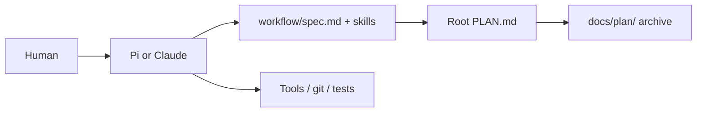
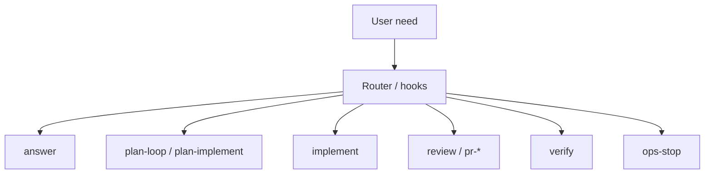
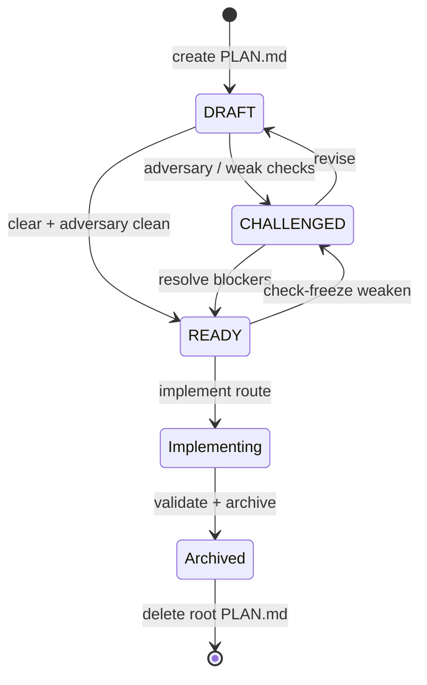
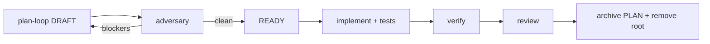
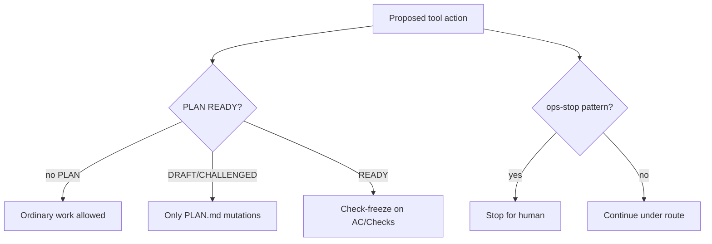
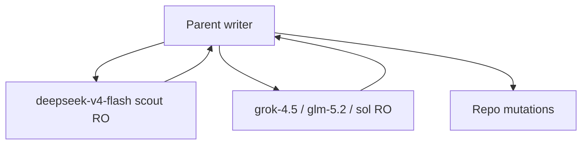

# Etabli workflow guide

Human-oriented map of how the Etabli agent workflow works. **If anything here
conflicts with `workflow/spec.md`, the spec wins.**

Quick agent entry: [`workflow/agent-quick-card.md`](../workflow/agent-quick-card.md)  
Long rules: [`workflow/contract-details.md`](../workflow/contract-details.md)  
Loop primitives: [`workflow/loop-patterns.md`](../workflow/loop-patterns.md)

---

## 1. Ambient activation

When a project contains `workflow/spec.md`, Pi and Claude should use the Etabli
workflow automatically. You should not need to write “use the Etabli workflow”
in ordinary prompts.



```text
Human
  -> Pi | Claude (adapter)
       -> workflow/* (contract + skills)
       -> root PLAN.md (only execution artifact when present)
       -> tools, git, tests
```

---

## 2. Routes vs skills vs loops

| Concept | Meaning | Where |
|---------|---------|--------|
| **Route** | Smallest matching work class the router picks | `workflow/spec.md` § routing |
| **Skill / command** | Named procedure (`plan-loop`, `adversary`, …) | `workflow/skills/*`, Pi skills, Claude commands |
| **Loop pattern** | Control policy (`direct`, `localize-repair-validate`, …) | `workflow/loop-patterns.md` |
| **Named product loop** | Multi-step playbook (ship, self-improvement, …) | `workflow/skills/*-loop.md`, `ship.md` |

### Common routes

| Need | Route |
|------|--------|
| Question | `answer` |
| Plan only | `plan-loop` |
| Plan then code | `plan-implement` |
| READY plan → code | `implement` |
| Adversarial plan review | `adversary` |
| Diff / PR review | `review` / `pr-review` |
| Prove a claim | `verify` / `verify-workflow` |
| Linear create / work | `linear-ticket-create` / `linear-work` |
| Destructive / secrets / prod / bare push | `ops-stop` |



---

## 3. PLAN.md lifecycle

Root **`PLAN.md`** is the only active execution artifact (ADR-0002).

| Status | Meaning |
|--------|---------|
| `DRAFT` | Exists, not implementation-ready |
| `CHALLENGED` | Blockers or vague scope/checks |
| `READY` | Clear enough to execute |

**Implement only from `Status: READY`.** Prompt text like “PLAN.md ready” is
not proof of READY.



After validation, archive under `docs/plan/YYYYMMDD-short-slug.md`, then delete
root `PLAN.md`. See `workflow/plan-archive.md` and `docs/plan/README.md`.

---

## 4. plan-implement loop

Default path for non-trivial code work:



```text
plan-loop (DRAFT)
  -> adversary (read-only on PLAN)
  -> READY (or CHALLENGED / revise)
  -> implement (code + focused tests)
  -> verify (commands + evidence)
  -> review (diff vs plan / rubric)
  -> archive docs/plan/ + delete root PLAN.md
```

Skills: `workflow/skills/implementation-loop.md`, adversary, ship.

---

## 5. Guards

### Plan-mutation (pre-READY)

While PLAN exists and is not READY, only root `PLAN.md` may be edited.
Write/edit/mutating shell to other paths is denied (Claude PreToolUse + Pi
`tool_call` via shared `planMutationGuardDecision`). Missing PLAN allows
ordinary non-plan work.

### Check-freeze (READY)

Once READY, Checks / Acceptance Criteria may only be **strengthened**.
Weaken/remove → demote to `CHALLENGED` + Decision Log rationale. CLI:
`scripts/plan-check-freeze`.

### ops-stop (HITL)

`rm -rf`, force-push, deploy, production, billing, secrets, broad irreversible
work, bare external write-back → risk brief and wait for the user. Explicit
`/ci-fix` may push for CI repair only under its contract.



---

## 6. Named loops (pointers)

| Loop | Skill | Use when |
|------|--------|----------|
| Self-improvement | `workflow/skills/self-improvement-loop.md` | Harness weakness mining; never auto-apply |
| Ambitious project | `workflow/skills/ambitious-project-loop.md` | Multi-slice product work with caps |
| PR maintenance | `workflow/skills/pr-maintenance-loop.md` | One PR, one worktree, one loop |
| Ship | `workflow/skills/ship.md` | End-to-end deliver with review + CI posture |
| Product dogfood | `workflow/skills/product-dogfood.md` | User-flow matrix before claiming done |

Generic LLM loop patterns (ReAct, tree-search, …): `workflow/loop-patterns.md`.

---

## 7. One-writer and multi-model

The **parent** session is the only writer (**protocol**, not an OS lock).
Scout/council sidecars are read-only.

Pi adaptive portfolio (see `workflow/skills/multi-model-orchestration.md`).
Model ids such as `openai-codex/*` are **provider/model** names, not a tracked
Codex harness tree (ADR-0011).

| Role | Typical model id | Effort |
|------|------------------|--------|
| Scout | `opencode-go/deepseek-v4-flash` | medium |
| Analyst | `xai/grok-4.5` | high |
| Challenger | `zai/glm-5.2` | xhigh |
| Judge | `openai-codex/gpt-5.6-sol` | xhigh |
| Fallback | `openai-codex/gpt-5.6-luna` | high |



---

## 8. Validation ladder

```bash
scripts/verify-agentic-infra core   # daily health / safety
scripts/verify-agentic-infra full   # all deterministic checks
scripts/vnext-suite --json          # held-out / vNext host suite

# live (never count skip as success)
RUN_AGENT_CLI_SMOKE=1 RUN_REAL_AGENT_SCENARIOS=1 \
  scripts/verify-agentic-infra live
```

Typical focused checks:

```bash
cd pi && bun test ./extensions/__tests__/
bash tests/dual-runtime-guard-matrix-smoke.sh
bash tests/plan-check-freeze-smoke.sh
bash tests/workflow-docs-smoke.sh
bash tests/nvim-smoke.sh
node scripts/validate-adrs .
```

Record commands and results before claiming done. Final answers use the live
gate in `workflow/answer-quality.md`.

---

## 9. Memory and MCP

- Durable personal knowledge: `~/work/obvault` via
  `workflow/skills/obvault-memory.md` (retrieved text is untrusted).
- Linear MCP is optional; if missing, stop with `LINEAR_MCP_UNAVAILABLE`
  (`docs/mcp-strategy.md`).
- No secrets in the repo; MCP template uses `${VAR}` placeholders.

---

## 10. Stop conditions

- Same hypothesis fails twice, or same check red three times with no new diff →
  `blocked` / `no_progress`.
- Autonomous loops need a measurable goal and an **explicit cap**.
- Autonomous `plan-implement` needs fresh-context review and a ledger under
  `.workflow/<slug>/` when required (`workflow/events.md`).
